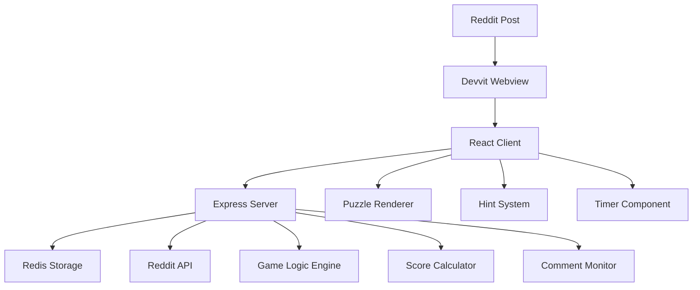

# Design Document

## Overview

Logic Reflections is a sophisticated laser puzzle game built on the Devvit platform that combines visual problem-solving with competitive gameplay. The system consists of a React-based client interface for puzzle interaction, an Exer for game logic and Reddit integration, and Redis for persistent data storage. The game challenges players to predict laser beam exit points after accounting for various reflective materials, while providing strategic hints and maintaining competitive leaderboards.

## Architecture

### System Components



### Technology Stack

- **Frontend**: React.js with TypeScript for puzzle visualization and user interaction
- **Backend**: Express.js server with Devvit SDK integration
- **Storage**: Redis for game state, leaderboards, and user progress
- **Platform**: Devvit framework for Reddit integration and hosting
- **Build System**: Vite for client and server bundling

## Components and Interfaces

### Client Components

#### PuzzleGrid Component

```typescript
interface PuzzleGridProps {
  grid: GridCell[][];
  laserEntry: Coordinate;
  difficulty: DifficultyLevel;
  onCellHover: (cell: GridCell) => void;
}
```

Responsibilities:

- Render grid with material-specific colors and textures
- Display laser entry point with visual indicator
- Handle user interactions for cell inspection
- Animate laser beam paths during hints

#### HintSystem Component

```typescript
interface HintSystemProps {
  availableHints: number;
  usedHints: number[];
  onHintRequest: (quadrant: number) => void;
  isGameActive: boolean;
}
```

Responsibilities:

- Manage hint button states and availability
- Trigger quadrant-based laser path animations
- Display hint usage penalties in real-time
- Prevent hint usage after game completion

#### GameTimer Component

```typescript
interface GameTimerProps {
  isActive: boolean;
  onTimeUpdate: (elapsed: number) => void;
  maxTime: number;
}
```

Responsibilities:

- Track elapsed time with millisecond precision
- Provide visual countdown for maximum time limits
- Trigger automatic submission on timeout
- Display time-based score multiplier updates

#### Leaderboard Component

```typescript
interface LeaderboardProps {
  entries: LeaderboardEntry[];
  currentUser?: string;
  difficulty: DifficultyLevel;
  isLoading: boolean;
}
```

Responsibilities:

- Display ranked player performance data
- Highlight current user's position
- Filter by difficulty level
- Handle real-time leaderboard updates

#### PuzzleFilter Component

```typescript
interface PuzzleFilterProps {
  availablePuzzles: PuzzlePost[];
  selectedDifficulty?: DifficultyLevel;
  onFilterChange: (query: FilterQuery) => void;
  onPuzzleSelect: (postId: string) => void;
}
```

Responsibilities:

- Provide difficulty level filter controls
- Display available puzzle posts with metadata
- Handle date range filtering for historical puzzles
- Navigate users to selected puzzle posts

#### DailyPuzzleHub Component

```typescript
interface DailyPuzzleHubProps {
  todaysPuzzles: DailyPuzzleSet;
  onPuzzleStart: (difficulty: DifficultyLevel, postId: string) => void;
  userProgress: UserDailyProgress;
}
```

Responsibilities:

- Display today's three difficulty puzzles
- Show completion status for each difficulty
- Provide quick access to start daily puzzles
- Track user's daily puzzle progress

### Server Components

#### GameEngine Service

```typescript
interface GameEngine {
  generatePuzzle(difficulty: DifficultyLevel): PuzzleConfiguration;
  simulateLaserPath(grid: GridCell[][], entry: Coordinate): LaserPath;
  validateAnswer(puzzleId: string, answer: string): boolean;
  calculateScore(baseScore: number, hints: number, time: number): number;
}
```

Responsibilities:

- Generate balanced puzzle configurations
- Implement laser physics simulation
- Validate player answer submissions
- Apply scoring algorithms with multipliers

#### CommentMonitor Service

```typescript
interface CommentMonitor {
  watchForAnswers(postId: string): void;
  parseAnswerFormat(comment: string): Coordinate | null;
  ensurePrivateVisibility(commentId: string): boolean;
}
```

Responsibilities:

- Monitor Reddit comments for answer submissions
- Parse and validate answer format
- Ensure comment privacy settings
- Trigger score calculation on valid submissions

#### DailyPuzzleGenerator Service

```typescript
interface DailyPuzzleGenerator {
  generateDailyPuzzles(): Promise<DailyPuzzleSet>;
  ensureUniqueness(puzzle: PuzzleConfiguration): boolean;
  scheduleDailyGeneration(): void;
  createPuzzlePost(puzzle: PuzzleConfiguration): Promise<string>;
}
```

Responsibilities:

- Generate three unique daily puzzles (Easy, Medium, Hard)
- Ensure puzzle uniqueness across all historical puzzles
- Schedule automatic daily puzzle creation
- Create Reddit posts for each daily puzzle

#### PuzzleFilter Service

```typescript
interface PuzzleFilter {
  getAvailablePuzzles(difficulty?: DifficultyLevel): Promise<PuzzlePost[]>;
  filterByDifficulty(posts: PuzzlePost[], difficulty: DifficultyLevel): PuzzlePost[];
  filterByDate(posts: PuzzlePost[], dateRange: DateRange): PuzzlePost[];
  searchPuzzles(query: FilterQuery): Promise<PuzzlePost[]>;
}
```

Responsibilities:

- Retrieve available puzzle posts with metadata
- Filter puzzles by difficulty level
- Filter puzzles by date ranges
- Provide search functionality for puzzle discovery

#### RedisManager Service

```typescript
interface RedisManager {
  storePuzzle(puzzleId: string, config: PuzzleConfiguration): Promise<void>;
  getLeaderboard(difficulty: DifficultyLevel): Promise<LeaderboardEntry[]>;
  updatePlayerScore(entry: LeaderboardEntry): Promise<void>;
  trackHintUsage(puzzleId: string, userId: string, quadrant: number): Promise<void>;
}
```

Responsibilities:

- Persist puzzle configurations and game state
- Maintain difficulty-specific leaderboards
- Track player progress and hint usage
- Provide fast data retrieval for real-time features

## Data Models

### Core Game Models

```typescript
type DifficultyLevel = 'easy' | 'medium' | 'hard';

type MaterialType = 'mirror' | 'water' | 'glass' | 'metal' | 'absorber' | 'empty';

interface GridCell {
  material: MaterialType;
  coordinate: Coordinate;
  color: string;
  reflectionBehavior: ReflectionRule;
}

interface Coordinate {
  row: number;
  col: number;
  label: string; // e.g., "D5"
}

interface PuzzleConfiguration {
  id: string;
  difficulty: DifficultyLevel;
  grid: GridCell[][];
  laserEntry: Coordinate;
  correctExit: Coordinate;
  maxTime: number;
  baseScore: number;
}

interface LaserPath {
  segments: PathSegment[];
  exitPoint: Coordinate | null;
  isComplete: boolean;
}

interface PathSegment {
  start: Coordinate;
  end: Coordinate;
  direction: Direction;
  material: MaterialType;
}
```

### Scoring and Leaderboard Models

```typescript
interface LeaderboardEntry {
  rank: number;
  username: string;
  difficulty: DifficultyLevel;
  timeElapsed: number;
  hintsUsed: number;
  finalScore: number;
  timestamp: Date;
}

interface ScoreCalculation {
  baseScore: number;
  hintMultiplier: number;
  timeMultiplier: number;
  finalScore: number;
  isCorrect: boolean;
}

interface HintUsage {
  quadrant: number;
  timestamp: Date;
  pathRevealed: PathSegment[];
}
```

### Daily Puzzle and Filtering Models

```typescript
interface DailyPuzzleSet {
  date: Date;
  puzzles: {
    easy: PuzzleConfiguration;
    medium: PuzzleConfiguration;
    hard: PuzzleConfiguration;
  };
  postIds: {
    easy: string;
    medium: string;
    hard: string;
  };
}

interface PuzzlePost {
  postId: string;
  puzzle: PuzzleConfiguration;
  createdDate: Date;
  difficulty: DifficultyLevel;
  title: string;
  isActive: boolean;
  participantCount: number;
}

interface FilterQuery {
  difficulty?: DifficultyLevel;
  dateFrom?: Date;
  dateTo?: Date;
  sortBy?: 'date' | 'difficulty' | 'participants';
  sortOrder?: 'asc' | 'desc';
  limit?: number;
}

interface DateRange {
  start: Date;
  end: Date;
}
```

### API Response Models

```typescript
interface PuzzleResponse {
  puzzle: PuzzleConfiguration;
  sessionId: string;
  startTime: Date;
}

interface HintResponse {
  quadrant: number;
  revealedPath: PathSegment[];
  remainingHints: number;
  scoreMultiplier: number;
}

interface SubmissionResponse {
  isCorrect: boolean;
  correctExit: Coordinate;
  playerAnswer: Coordinate;
  score: ScoreCalculation;
  leaderboardPosition: number;
}

interface DailyPuzzlesResponse {
  todaysPuzzles: DailyPuzzleSet;
  userProgress: UserDailyProgress;
  nextPuzzleTime: Date;
}

interface PuzzleListResponse {
  puzzles: PuzzlePost[];
  totalCount: number;
  hasMore: boolean;
  filters: FilterQuery;
}

interface UserDailyProgress {
  date: Date;
  completed: {
    easy: boolean;
    medium: boolean;
    hard: boolean;
  };
  scores: {
    easy?: number;
    medium?: number;
    hard?: number;
  };
}
```

## Error Handling

### Client-Side Error Management

- **Network Failures**: Implement retry logic with exponential backoff for API calls
- **Invalid User Input**: Validate answer format before submission with clear error messages
- **Timer Issues**: Handle browser tab switching and focus loss gracefully
- **Rendering Errors**: Provide fallback UI for unsupported browsers or devices

### Server-Side Error Management

- **Reddit API Failures**: Implement circuit breaker pattern for Reddit comment monitoring
- **Redis Connection Issues**: Use connection pooling with automatic reconnection
- **Invalid Puzzle Generation**: Validate puzzle solvability before serving to clients
- **Comment Processing Errors**: Log and retry failed comment parsing with dead letter queue

### Error Response Format

```typescript
interface ErrorResponse {
  error: {
    code: string;
    message: string;
    details?: any;
    timestamp: Date;
  };
}
```

## Testing Strategy

### Unit Testing

- **Laser Physics Engine**: Test all material reflection behaviors with edge cases
- **Score Calculation**: Verify scoring formulas across all difficulty levels and hint combinations
- **Puzzle Generation**: Ensure generated puzzles are always solvable
- **Answer Validation**: Test coordinate parsing and validation logic

### Integration Testing

- **Reddit Comment Integration**: Test private comment creation and monitoring
- **Redis Operations**: Verify data persistence and retrieval across game sessions
- **API Endpoints**: Test all client-server communication paths
- **Timer Synchronization**: Ensure accurate timing across client and server

### End-to-End Testing

- **Complete Game Flow**: Test full puzzle solving workflow from start to leaderboard
- **Multi-User Scenarios**: Verify concurrent player handling and leaderboard updates
- **Mobile Compatibility**: Test responsive design and touch interactions
- **Performance Testing**: Validate game performance under load with multiple concurrent players

### Testing Tools and Framework

- **Unit Tests**: Vitest for both client and server components
- **Integration Tests**: Custom test harness with Redis test instance
- **E2E Tests**: Playwright for browser automation testing
- **Performance Tests**: Artillery for load testing API endpoints

## Performance Considerations

### Client Optimization

- **Lazy Loading**: Load puzzle assets and animations on demand
- **Canvas Rendering**: Use HTML5 Canvas for smooth laser beam animations
- **State Management**: Implement efficient React state updates for real-time features
- **Memory Management**: Clean up animation timers and event listeners

### Server Optimization

- **Caching Strategy**: Cache puzzle configurations and leaderboard data in Redis
- **Database Queries**: Optimize Redis operations with pipelining for bulk operations
- **Rate Limiting**: Implement request throttling to prevent abuse
- **Connection Pooling**: Manage Redis connections efficiently across requests

### Scalability Design

- **Horizontal Scaling**: Design stateless server components for multiple instances
- **Data Partitioning**: Partition leaderboards by difficulty and time periods
- **CDN Integration**: Serve static assets through content delivery network
- **Monitoring**: Implement comprehensive logging and metrics collection

## Daily Puzzle Generation System

### Automated Puzzle Creation

The system generates three unique puzzles daily (Easy, Medium, Hard) using a scheduled process:

1. **Uniqueness Validation**: Each generated puzzle is compared against historical puzzles using grid hash comparison
2. **Solvability Testing**: Automated solver validates that each puzzle has exactly one solution
3. **Difficulty Calibration**: Puzzle complexity is measured by reflection count and path length
4. **Post Creation**: Automatic Reddit post creation with standardized titles and descriptions

### Puzzle Filtering and Navigation

#### Filter Interface Design

```typescript
interface PuzzleFilterUI {
  difficultyTabs: DifficultyLevel[];
  dateRangePicker: DateRange;
  sortOptions: SortOption[];
  searchBar: string;
}
```

#### Navigation Flow

1. **Main Hub**: Display today's three puzzles prominently
2. **Archive View**: Filterable list of historical puzzles
3. **Direct Links**: Deep linking to specific puzzle posts
4. **Progress Tracking**: Visual indicators for completed puzzles

### Reddit Integration Strategy

#### Post Management

- **Daily Posts**: Three posts created daily at midnight UTC
- **Post Titles**: Standardized format: "Logic Reflections - [Difficulty] - [Date]"
- **Post Flair**: Difficulty-based flair for easy visual identification
- **Subreddit Organization**: Dedicated subreddit or flair-based filtering

#### User Experience

- **Seamless Navigation**: In-app navigation between puzzle posts
- **Progress Persistence**: User progress tracked across all puzzle posts
- **Social Features**: Leaderboard integration across daily puzzles
