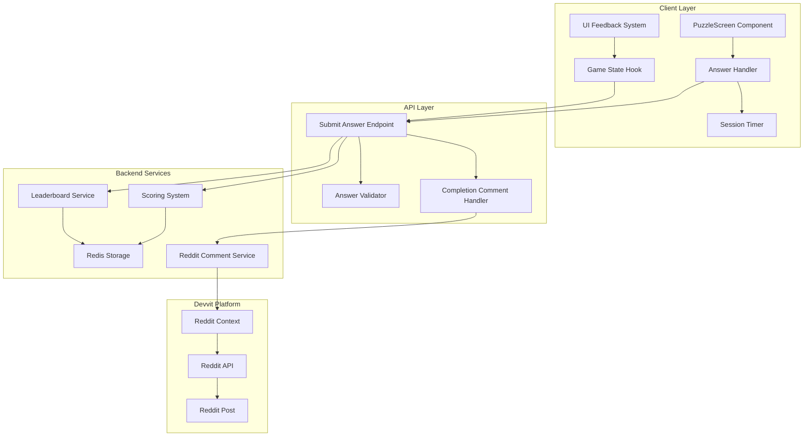

# Design Document

## Overview

The Direct Answer Submission system enhances ReflectIQ's existing answer validation flow by replacing comment-based submission with immediate in-app validation. Since Reddit Devvit does not support private comments, the system leverages the existing puzzle interface to provide instant feedback, real-time leaderboard updates, and automated completion comments. The design builds upon the current architecture while adding the missing completion comment functionality and ensuring full Devvit compliance.

## Architecture

### High-Level Architecture



### Current Implementation Status

The system already has most components implemented:

- ✅ **PuzzleScreen Component**: Handles answer input and submission
- ✅ **Answer Validation**: Existing `submitAnswer` endpoint validates answers
- ✅ **Scoring System**: Calculates scores based on time, hints, and accuracy
- ✅ **Leaderboard Updates**: Real-time Redis-based leaderboard management
- ✅ **Timer Integration**: Session timer tracks completion time
- ⚠️ **Completion Comments**: Partially implemented but needs format alignment
- ❌ **Devvit Handler**: Missing server-side handler for comment posting

### Data Flow

1. **Answer Submission**: User selects exit cell and clicks "Submit Answer"
2. **Client Validation**: PuzzleScreen validates selection exists
3. **Timer Capture**: Session timer stops and captures completion time
4. **API Call**: Enhanced API service calls `/api/puzzle/submit`
5. **Server Validation**: Answer validator checks against puzzle solution
6. **Score Calculation**: Scoring system calculates final score with multipliers
7. **Leaderboard Update**: Redis leaderboard updated with new entry
8. **Comment Posting**: Completion comment posted to Reddit via Devvit context
9. **Client Response**: Success/error feedback displayed to user

## Components and Interfaces

### 1. Enhanced PuzzleScreen Component

```typescript
interface PuzzleScreenProps {
  puzzle: Puzzle;
  session: SessionData;
  hintsUsed: number;
  hintPaths: HintPath[];
  isTimerRunning: boolean;
  isRequestingHint?: boolean;
  onRequestHint: () => void;
  onSubmitAnswer: (answer: GridPosition, timeTaken: number) => void;
  onBack: () => void;
}

interface SubmitHandler {
  validateSelection(): boolean;
  captureCompletionTime(): number;
  submitToServer(answer: GridPosition, time: number): Promise<void>;
  handleResponse(response: SubmitAnswerResponse): void;
}
```

**Current Implementation**: Already exists with proper answer input and submission flow
**Required Changes**: None - current implementation is sufficient

### 2. Answer Submission API Endpoint

```typescript
// Existing endpoint: POST /api/puzzle/submit
interface SubmitAnswerRequest {
  sessionId: string;
  answer: GridPosition; // [row, col] format
  timeTaken: number; // seconds as integer
}

interface SubmitAnswerResponse
  extends ApiResponse<{
    scoreResult: ScoreResult;
    submission: Submission;
    leaderboardPosition?: number;
  }> {}
```

**Current Implementation**: Fully implemented with validation, scoring, and leaderboard updates
**Required Changes**: Update comment format to match requirements

### 3. Completion Comment System

```typescript
interface CompletionCommentHandler {
  formatCompletionComment(username: string, timeTaken: number, hintsUsed: number): string;

  postCompletionComment(context: Devvit.Context, commentText: string): Promise<void>;
}

// Target comment format
const COMMENT_TEMPLATE = 'u/{username} completed the puzzle in {time} with {hints} hints!';

// Example outputs:
// "u/werewolf013 completed the puzzle in 0:01 with 0 hints!"
// "u/player123 completed the puzzle in 2:45 with 2 hints!"
```

**Current Implementation**: Basic comment posting exists but format needs alignment
**Required Changes**: Update comment format and ensure proper time formatting

### 4. Timer Integration

```typescript
interface SessionTimer {
  startTime: Date;
  currentTime: number; // seconds elapsed
  isRunning: boolean;

  start(): void;
  stop(): number; // returns final time
  pause(): void;
  resume(): void;
  formatTime(seconds: number): string; // "M:SS" format
}
```

**Current Implementation**: Timer component exists with proper callback mechanism
**Required Changes**: Ensure time formatting matches comment requirements (M:SS format)

## Data Models

### Enhanced Submission Flow

```typescript
interface SubmissionFlow {
  // Client-side data
  selectedAnswer: GridPosition;
  completionTime: number;
  sessionData: SessionData;

  // Server-side processing
  validation: {
    isCorrect: boolean;
    correctAnswer: GridPosition;
  };

  scoring: {
    baseScore: number;
    hintMultiplier: number;
    timeBonus: number;
    finalScore: number;
  };

  leaderboard: {
    position: number;
    totalPlayers: number;
    updated: boolean;
  };

  comment: {
    posted: boolean;
    text: string;
    error?: string;
  };
}
```

### Comment Data Structure

```typescript
interface CompletionComment {
  username: string; // From Devvit context.reddit.getCurrentUser()
  timeTaken: number; // Seconds as integer
  hintsUsed: number; // 0-4
  difficulty: Difficulty; // Easy, Medium, Hard
  score: number;

  // Formatted outputs
  timeFormatted: string; // "0:01", "2:45", etc.
  commentText: string; // Final comment string
}
```

## Error Handling

### Client-Side Error Handling

```typescript
interface SubmissionErrorHandling {
  // Validation errors
  handleNoSelection(): void; // "Please select an exit cell first"
  handleInvalidSelection(): void; // "Invalid selection"

  // Network errors
  handleNetworkError(error: ApiError): void;
  handleTimeout(): void;

  // Server errors
  handleValidationError(error: ApiError): void;
  handleScoringError(): void;

  // Recovery actions
  enableRetry(): void;
  resetSubmission(): void;
}
```

### Server-Side Error Handling

```typescript
interface ServerErrorHandling {
  // Answer validation errors
  handleInvalidSession(sessionId: string): ApiResponse;
  handleInvalidAnswer(answer: GridPosition): ApiResponse;

  // Scoring errors
  handleScoringFailure(submission: Submission): ApiResponse;

  // Leaderboard errors
  handleLeaderboardUpdateFailure(): void; // Log but don't fail submission

  // Comment posting errors
  handleCommentPostingFailure(error: Error): void; // Log but don't fail submission
}
```

### Error Recovery Strategies

1. **Comment Posting Failures**: Log error but don't fail the submission
2. **Leaderboard Update Failures**: Queue for retry, show success to user
3. **Network Failures**: Use existing retry logic from EnhancedApiService
4. **Validation Failures**: Clear feedback with retry option

## Testing Strategy

### Unit Testing

```typescript
describe('Direct Answer Submission', () => {
  describe('PuzzleScreen Component', () => {
    test('validates answer selection before submission');
    test('captures completion time accurately');
    test('handles submission success/failure states');
    test('displays appropriate feedback messages');
  });

  describe('Answer Validation', () => {
    test('correctly validates correct answers');
    test('correctly identifies incorrect answers');
    test('handles edge cases and invalid inputs');
  });

  describe('Completion Comments', () => {
    test('formats comment text correctly');
    test('handles different time formats (0:01, 2:45, etc.)');
    test('includes correct hint count');
    test('uses proper username from Devvit context');
  });
});
```

### Integration Testing

```typescript
describe('End-to-End Submission Flow', () => {
  test('complete successful submission workflow');
  test('handles incorrect answer with retry');
  test('updates leaderboard correctly');
  test('posts completion comment to Reddit');
  test('handles offline/online transitions');
});
```

### Devvit Platform Testing

```typescript
describe('Devvit Integration', () => {
  test('Reddit context provides correct user information');
  test('Comment posting uses correct post ID');
  test('Handles Devvit authentication properly');
  test('Respects Reddit API rate limits');
});
```

## Security Considerations

### Input Validation

1. **Answer Validation**: Ensure GridPosition is within valid bounds
2. **Session Validation**: Verify session exists and belongs to user
3. **Time Validation**: Prevent manipulation of completion times
4. **Rate Limiting**: Prevent spam submissions

### Reddit Integration Security

1. **Comment Permissions**: Use Devvit context for proper authentication
2. **Content Safety**: Ensure comment text complies with Reddit policies
3. **User Privacy**: Only use publicly available Reddit usernames
4. **Error Information**: Don't expose sensitive system details in errors

## Performance Considerations

### Client Performance

1. **Immediate Feedback**: Show loading states during submission
2. **Error Recovery**: Quick retry mechanisms for failed submissions
3. **Memory Management**: Proper cleanup of timer and event listeners
4. **Bundle Size**: Leverage existing components without adding bulk

### Server Performance

1. **Redis Efficiency**: Use atomic operations for leaderboard updates
2. **Comment Batching**: Consider batching comment posts if volume is high
3. **Error Logging**: Efficient logging without impacting response times
4. **Concurrent Submissions**: Handle multiple simultaneous submissions safely

## Implementation Notes

### Existing Code Leverage

The implementation should maximize use of existing code:

1. **PuzzleScreen Component**: Already handles answer input and submission UI
2. **Enhanced API Service**: Provides robust error handling and retry logic
3. **Game State Hook**: Manages submission flow and state updates
4. **Scoring System**: Complete implementation of score calculation
5. **Leaderboard Service**: Redis-based ranking system is fully functional

### Required Modifications

1. **Comment Format**: Update existing comment posting to match exact requirements
2. **Time Formatting**: Ensure timer displays and comment use consistent M:SS format
3. **Error Handling**: Enhance feedback for comment posting failures
4. **Devvit Handler**: Create proper server-side handler for comment posting

### Devvit Best Practices

1. **Context Usage**: Use `context.reddit.getCurrentUser()` for username
2. **Comment API**: Use `context.reddit.submitComment()` for posting
3. **Error Handling**: Graceful degradation when Reddit API is unavailable
4. **Resource Management**: Proper cleanup and memory management
5. **Rate Limiting**: Respect Reddit's API limits and implement backoff
