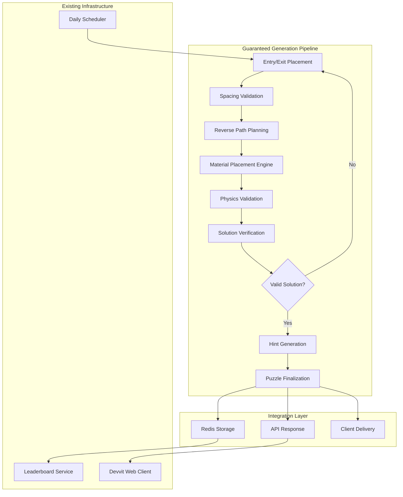

# Design Document

## Overview

The Guaranteed Puzzle Generation system enhances ReflectIQ's puzzle creation capabilities by implementing a reverse-engineering approach that ensures 100% solvable puzzles. Following Devvit Web architecture patterns, this system integrates seamlessly with the existing backend infrastructure while introducing sophisticated algorithms for strategic entry/exit placement and material positioning. The design maintains compatibility with current Redis schemas, API endpoints, and client interfaces while dramatically improving puzzle quality and player satisfaction.

## Architecture

### Enhanced Puzzle Generation Flow



### Core Algorithm Architecture

The system implements a three-phase generation approach:

1. **Strategic Placement Phase**: Intelligently selects entry/exit points with difficulty-appropriate spacing
2. **Reverse Engineering Phase**: Works backwards from exit to entry, placing materials to create valid paths
3. **Validation Phase**: Ensures physics compliance and solution uniqueness

### Integration with Existing Systems

```typescript
// Enhanced PuzzleEngine interface extending current architecture
interface EnhancedPuzzleEngine extends PuzzleEngine {
  generateGuaranteedPuzzle(difficulty: Difficulty): Promise<Puzzle>;
  validateSpacingConstraints(
    entry: GridPosition,
    exit: GridPosition,
    difficulty: Difficulty
  ): boolean;
  reverseEngineerPath(
    entry: GridPosition,
    exit: GridPosition,
    gridSize: number
  ): Promise<Material[]>;
  verifyUniqueSolution(puzzle: Puzzle): boolean;
}
```

## Components and Interfaces

### 1. Strategic Point Placement Service

```typescript
interface PointPlacementService {
  selectEntryExitPairs(difficulty: Difficulty, gridSize: number): Promise<EntryExitPair[]>;
  validateSpacing(entry: [number, number], exit: [number, number], minDistance: number): boolean;
  getBoundaryPositions(gridSize: number): [number, number][];
  calculateDistance(pos1: [number, number], pos2: [number, number]): number;
}

interface EntryExitPair {
  entry: [number, number];
  exit: [number, number];
  distance: number;
  difficulty: Difficulty;
  validationScore: number; // Higher score = better placement
}

// Spacing constraints by difficulty
const SPACING_CONSTRAINTS = {
  Easy: { minDistance: 3, preferredDistance: 4 },
  Medium: { minDistance: 4, preferredDistance: 6 },
  Hard: { minDistance: 5, preferredDistance: 8 },
} as const;
```

**Responsibilities:**

- Generate multiple entry/exit candidates with proper spacing
- Rank candidates by strategic value (corner vs edge positions)
- Ensure boundary-only placement following grid constraints
- Validate minimum distance requirements per difficulty

### 2. Reverse Path Engineering Service

```typescript
interface ReversePathService {
  planOptimalPath(
    entry: [number, number],
    exit: [number, number],
    difficulty: Difficulty
  ): Promise<PathPlan>;
  placeMaterialsForPath(pathPlan: PathPlan, gridSize: number): Promise<Material[]>;
  optimizeMaterialDensity(materials: Material[], targetDensity: number): Material[];
  validatePathPhysics(materials: Material[], entry: [number, number]): LaserPath;
}

interface PathPlan {
  requiredReflections: number;
  keyReflectionPoints: [number, number][];
  materialRequirements: MaterialRequirement[];
  complexityScore: number;
}

interface MaterialRequirement {
  position: [number, number];
  materialType: MaterialType;
  angle?: number; // For mirrors
  priority: 'critical' | 'supporting' | 'decorative';
}
```

**Responsibilities:**

- Design laser path working backwards from exit to entry
- Calculate required reflection points for difficulty-appropriate complexity
- Determine optimal material types and positions for each reflection
- Balance material density with solution clarity

### 3. Solution Validation Engine

```typescript
interface SolutionValidator {
  verifyUniqueSolution(puzzle: Puzzle): ValidationResult;
  checkAlternativePaths(puzzle: Puzzle): AlternativePath[];
  validatePhysicsCompliance(puzzle: Puzzle): PhysicsValidation;
  generateConfidenceScore(puzzle: Puzzle): number;
}

interface ValidationResult {
  isValid: boolean;
  hasUniqueSolution: boolean;
  alternativeCount: number;
  physicsCompliant: boolean;
  confidenceScore: number; // 0-100
  issues: ValidationIssue[];
}

interface ValidationIssue {
  type: 'multiple_solutions' | 'no_solution' | 'physics_violation' | 'infinite_loop';
  description: string;
  affectedPositions: [number, number][];
  severity: 'critical' | 'warning' | 'info';
}
```

**Responsibilities:**

- Simulate complete laser physics to verify solution
- Detect multiple solution paths and eliminate them
- Ensure physics rules are followed exactly
- Provide detailed feedback for puzzle refinement

### 4. Enhanced API Endpoints

```typescript
// Extended API maintaining backward compatibility
interface EnhancedAPIEndpoints extends APIEndpoints {
  'POST /api/puzzle/generate': (config: GenerationConfig) => Promise<Puzzle>;
  'GET /api/puzzle/validate': (puzzleId: string) => Promise<ValidationResult>;
  'POST /api/puzzle/regenerate': (puzzleId: string, reason: string) => Promise<Puzzle>;
}

interface GenerationConfig {
  difficulty: Difficulty;
  forceRegeneration?: boolean;
  maxAttempts?: number; // Default: 10
  targetComplexity?: number; // 1-10 scale
  preferredMaterials?: MaterialType[];
}
```

### 5. Redis Schema Extensions

```typescript
// Enhanced Redis schema maintaining compatibility
interface EnhancedRedisSchema extends RedisSchema {
  // Generation metadata
  'reflectiq:generation:{puzzleId}': GenerationMetadata;

  // Validation cache
  'reflectiq:validation:{puzzleId}': ValidationResult;

  // Performance metrics
  'reflectiq:metrics:generation': GenerationMetrics;
}

interface GenerationMetadata {
  puzzleId: string;
  generationAttempts: number;
  generationTime: number; // milliseconds
  algorithm: 'guaranteed' | 'legacy';
  confidenceScore: number;
  validationPassed: boolean;
  createdAt: Date;
}

interface GenerationMetrics {
  totalGenerated: number;
  successRate: number;
  averageGenerationTime: number;
  difficultyBreakdown: Record<Difficulty, number>;
  lastUpdated: Date;
}
```

## Data Models

### Enhanced Puzzle Model

```typescript
// Note: Uses existing Puzzle interface from src/shared/types/puzzle.ts
// Core Puzzle interface remains unchanged for compatibility:
// interface Puzzle {
//   id: string;
//   difficulty: Difficulty;
//   gridSize: 6 | 8 | 10;
//   materials: Material[];
//   entry: GridPosition;
//   solution: GridPosition;
//   solutionPath: LaserPath;
//   hints: HintPath[];
//   createdAt: Date;
//   materialDensity: number;
// }

// Generation metadata stored separately to maintain interface compatibility
interface PuzzleGenerationMetadata {
  puzzleId: string;
  algorithm: 'guaranteed' | 'legacy';
  attempts: number;
  generationTime: number;
  confidenceScore: number;
  validationPassed: boolean;
  spacingDistance: number;
  pathComplexity: number;
  createdAt: Date;
}

// Solution analysis data for validation and optimization
interface PuzzleSolutionAnalysis {
  puzzleId: string;
  uniqueSolution: boolean;
  alternativeCount: number;
  reflectionCount: number;
  materialUtilization: number; // percentage of materials used in solution
  physicsCompliant: boolean;
}
```

### Algorithm Configuration Models

```typescript
interface AlgorithmConfig {
  maxGenerationAttempts: number; // Default: 10
  minConfidenceScore: number; // Default: 85
  timeoutMs: number; // Default: 5000

  spacingConfig: Record<Difficulty, SpacingConfig>;
  materialConfig: Record<Difficulty, MaterialConfig>;
  complexityConfig: Record<Difficulty, ComplexityConfig>;
}

interface SpacingConfig {
  minDistance: number;
  preferredDistance: number;
  cornerBonus: number; // Preference for corner positions
  edgeBonus: number; // Preference for edge positions
}

interface MaterialConfig {
  targetDensity: number; // 0.7, 0.8, 0.85
  allowedMaterials: MaterialType[];
  materialWeights: Record<MaterialType, number>; // Preference weights
  maxMaterialsPerType: number;
}

interface ComplexityConfig {
  minReflections: number;
  maxReflections: number;
  preferredReflections: number;
  pathLengthMultiplier: number;
}
```

## Error Handling

### Generation-Specific Error Handling

```typescript
interface GenerationErrorHandler {
  handleGenerationTimeout(config: GenerationConfig): Promise<Puzzle>;
  handleValidationFailure(puzzle: Puzzle, issues: ValidationIssue[]): Promise<Puzzle>;
  handleSpacingConstraintFailure(difficulty: Difficulty): Promise<EntryExitPair>;
  handleMaterialPlacementFailure(pathPlan: PathPlan): Promise<Material[]>;
}

// Error recovery strategies
const ERROR_RECOVERY_STRATEGIES = {
  GENERATION_TIMEOUT: 'fallback_to_legacy',
  VALIDATION_FAILURE: 'retry_with_relaxed_constraints',
  SPACING_FAILURE: 'expand_search_space',
  MATERIAL_FAILURE: 'simplify_path_requirements',
} as const;
```

### Fallback Mechanisms

1. **Generation Timeout**: Fall back to legacy generation with warning
2. **Validation Failure**: Retry with relaxed constraints up to 3 times
3. **Spacing Constraints**: Expand search to include sub-optimal positions
4. **Material Placement**: Simplify path requirements and retry

## Testing Strategy

### Algorithm Testing

```typescript
describe('Guaranteed Puzzle Generation', () => {
  describe('Point Placement', () => {
    test('generates valid entry/exit pairs for all difficulties');
    test('maintains minimum spacing constraints');
    test('prefers strategic positions (corners, edges)');
    test('handles edge cases (small grids, limited positions)');
  });

  describe('Reverse Path Engineering', () => {
    test('creates valid paths from any entry/exit combination');
    test('respects material density constraints');
    test('generates appropriate complexity for difficulty');
    test('avoids infinite reflection loops');
  });

  describe('Solution Validation', () => {
    test('detects unique solutions correctly');
    test('identifies multiple solution paths');
    test('validates physics compliance');
    test('generates accurate confidence scores');
  });
});
```

### Performance Testing

```typescript
describe('Generation Performance', () => {
  test('completes generation within 5 second timeout');
  test('maintains 100% success rate across difficulties');
  test('handles concurrent generation requests');
  test('scales with increased material complexity');
});
```

### Integration Testing

```typescript
describe('System Integration', () => {
  test('integrates with existing daily puzzle scheduler');
  test('maintains API compatibility with current clients');
  test('preserves Redis schema compatibility');
  test('works with existing hint generation system');
});
```

## Security Considerations

### Algorithm Security

1. **Deterministic Generation**: Ensure reproducible results for debugging
2. **Resource Limits**: Prevent infinite loops and excessive computation
3. **Input Validation**: Validate all generation parameters
4. **Rate Limiting**: Prevent abuse of generation endpoints

### Data Integrity

1. **Validation Checksums**: Verify puzzle integrity after generation
2. **Audit Trails**: Log all generation attempts and outcomes
3. **Rollback Capability**: Ability to revert to previous puzzle versions
4. **Quality Metrics**: Monitor generation success rates and performance

## Performance Optimization

### Generation Optimization

```typescript
interface OptimizationStrategies {
  // Caching strategies
  cacheValidEntryExitPairs: boolean;
  cacheMaterialPlacements: boolean;
  cacheValidationResults: boolean;

  // Parallel processing
  parallelCandidateGeneration: boolean;
  parallelValidation: boolean;

  // Early termination
  earlySuccessTermination: boolean;
  confidenceThresholdTermination: boolean;
}
```

### Memory Management

1. **Efficient Data Structures**: Use optimized representations for grid operations
2. **Garbage Collection**: Proper cleanup of generation attempts
3. **Memory Pooling**: Reuse objects for repeated operations
4. **Streaming Validation**: Process large grids in chunks

## Deployment Strategy

### Gradual Rollout

1. **Phase 1**: Deploy alongside existing system with feature flag
2. **Phase 2**: A/B test with 10% of puzzle generation
3. **Phase 3**: Gradually increase to 50% based on success metrics
4. **Phase 4**: Full rollout with legacy system as fallback

### Monitoring and Metrics

```typescript
interface GenerationMetrics {
  successRate: number; // Target: 100%
  averageGenerationTime: number; // Target: <2 seconds
  confidenceScoreDistribution: number[]; // Target: >85 average
  playerSatisfactionScore: number; // From feedback
  puzzleCompletionRate: number; // Target: >90%
}
```

### Feature Flags

```typescript
interface FeatureFlags {
  enableGuaranteedGeneration: boolean;
  fallbackToLegacy: boolean;
  enableAdvancedValidation: boolean;
  enablePerformanceLogging: boolean;
  maxGenerationAttempts: number;
}
```

This design ensures the guaranteed puzzle generation system integrates seamlessly with ReflectIQ's existing Devvit architecture while providing the enhanced reliability and quality that players deserve.
