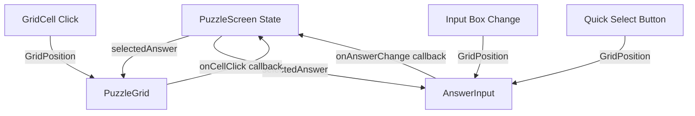

# Design Document: Interactive Grid Answer Selection

## Overview

This design document outlines the implementation approach for enabling bidirectional interaction between the puzzle grid and answer input components in ReflectIQ. The feature allows users to select their answer by clicking on grid cells, with automatic synchronization between the grid visual state and the input box. The implementation follows Devvit's React-based web view patterns and maintains consistency with the existing codebase architecture.

### Key Design Goals

1. **Intuitive Interaction**: Enable direct grid cell clicking as a primary answer selection method
2. **State Synchronization**: Maintain consistent state across grid cells, input box, and quick-select buttons
3. **Visual Feedback**: Provide clear visual indicators for selectable cells, selected cells, and hover states
4. **Minimal Refactoring**: Leverage existing component structure and state management patterns
5. **Devvit Compliance**: Follow Devvit's React component patterns and TypeScript best practices

## Architecture

### Component Hierarchy

```
PuzzleScreen (State Owner)
├── PuzzleGrid
│   └── GridCell (Enhanced with click handlers)
├── AnswerInput (Enhanced with external state updates)
└── Submit Button
```

### State Management Flow



The state management follows a unidirectional data flow pattern:

- **PuzzleScreen** owns the `selectedAnswer` state
- Child components receive state as props and communicate changes via callbacks
- All input methods (grid click, typing, button click) flow through the same state update mechanism

## Components and Interfaces

### 1. GridCell Component (Modified)

**New Props:**

```typescript
interface GridCellProps {
  row: number;
  col: number;
  material?: Material;
  isEntry?: boolean;
  isExit?: boolean;
  isOnLaserPath?: boolean;
  // New props
  isEdgeCell: boolean;
  isSelected: boolean;
  onCellClick?: (row: number, col: number) => void;
}
```

**Behavior:**

- Determines if cell is clickable based on `isEdgeCell` prop
- Applies visual styling for selected state when `isSelected` is true
- Invokes `onCellClick` callback when clicked (only if `isEdgeCell` is true)
- Shows hover effects only for edge cells
- Maintains existing material, entry, exit, and laser path indicators

**Visual States:**

- **Default Edge Cell**: Cursor pointer, subtle hover effect (border glow or scale)
- **Selected Edge Cell**: Distinct ring/border (e.g., blue ring-2), elevated z-index
- **Hover Edge Cell**: Temporary highlight (e.g., border-primary/50)
- **Non-Edge Cell**: Default cursor, no hover effects, no click handler

### 2. PuzzleGrid Component (Modified)

**New Props:**

```typescript
interface PuzzleGridProps {
  puzzle: Puzzle;
  hintPaths: HintPath[];
  hintsUsed?: number;
  // New props
  selectedAnswer: GridPosition | null;
  onCellClick: (row: number, col: number) => void;
}
```

**Responsibilities:**

- Calculate which cells are edge cells during rendering
- Pass `isEdgeCell` boolean to each GridCell
- Pass `isSelected` boolean by comparing GridCell position with `selectedAnswer`
- Forward `onCellClick` callback to GridCell components
- Maintain existing laser path rendering and hint animation logic

**Edge Cell Calculation:**

```typescript
const isEdgeCell = (row: number, col: number, gridSize: number): boolean => {
  return row === 0 || row === gridSize - 1 || col === 0 || col === gridSize - 1;
};
```

### 3. AnswerInput Component (Modified)

**Modified Behavior:**

- Accept external updates to `inputValue` state via `selectedAnswer` prop changes
- Use `useEffect` hook to synchronize input box text when `selectedAnswer` changes externally
- Maintain existing parsing, formatting, and validation logic
- Keep quick-select buttons functional with synchronized selection state

**State Synchronization Pattern:**

```typescript
useEffect(() => {
  if (selectedAnswer) {
    const formatted = formatAnswer(selectedAnswer);
    setInputValue(formatted);
  } else {
    setInputValue('');
  }
}, [selectedAnswer]);
```

### 4. PuzzleScreen Component (Modified)

**State Management:**

```typescript
const [selectedAnswer, setSelectedAnswer] = useState<GridPosition | null>(null);

const handleCellClick = useCallback((row: number, col: number) => {
  const newAnswer: GridPosition = [row, col];
  setSelectedAnswer(newAnswer);
}, []);

const handleAnswerChange = useCallback((answer: GridPosition | null) => {
  setSelectedAnswer(answer);
}, []);
```

**Props Distribution:**

- Pass `selectedAnswer` to both PuzzleGrid and AnswerInput
- Pass `handleCellClick` to PuzzleGrid
- Pass `handleAnswerChange` to AnswerInput
- Maintain existing timer, hint, and submission logic

## Data Models

### GridPosition Type

```typescript
type GridPosition = [number, number]; // [row, col]
```

### Cell State Interface

```typescript
interface CellState {
  position: GridPosition;
  isEdgeCell: boolean;
  isSelected: boolean;
  isClickable: boolean;
}
```

### Answer State

```typescript
interface AnswerState {
  selectedAnswer: GridPosition | null;
  inputValue: string;
  isValid: boolean;
}
```

## Error Handling

### Invalid Cell Clicks

- **Non-Edge Cell Clicks**: Silently ignored (no callback invocation)
- **Visual Feedback**: Non-edge cells show no hover state or cursor change

### State Synchronization Failures

- **Input Parse Errors**: Display existing error message, set `selectedAnswer` to null
- **Invalid Grid Position**: Validate bounds before setting state
- **Race Conditions**: Use React's state batching and `useCallback` for stable references

### Edge Cases

1. **Rapid Clicking**: Debounce not required (React batches state updates)
2. **Simultaneous Input Methods**: Last update wins (standard React behavior)
3. **Grid Size Changes**: Reset `selectedAnswer` to null when puzzle changes
4. **Component Unmount**: No cleanup required (no subscriptions or timers)

## Testing Strategy

### Unit Tests

**GridCell Component:**

- Test edge cell click invokes callback with correct coordinates
- Test non-edge cell click does not invoke callback
- Test selected state applies correct CSS classes
- Test hover state only applies to edge cells

**PuzzleGrid Component:**

- Test edge cell calculation for various grid sizes (4x4, 6x6, 8x8)
- Test `isSelected` prop correctly identifies selected cell
- Test callback forwarding to GridCell components

**AnswerInput Component:**

- Test `useEffect` synchronizes input value when `selectedAnswer` changes
- Test manual input updates `selectedAnswer` via callback
- Test quick-select buttons update `selectedAnswer` via callback
- Test invalid input clears `selectedAnswer`

**PuzzleScreen Component:**

- Test `handleCellClick` updates `selectedAnswer` state
- Test `handleAnswerChange` updates `selectedAnswer` state
- Test state changes propagate to child components

### Integration Tests

**End-to-End Flow:**

1. Click edge cell → verify input box updates → verify cell shows selected state
2. Type in input box → verify grid cell shows selected state
3. Click quick-select button → verify grid cell shows selected state → verify input box updates
4. Click different edge cell → verify previous cell deselects → verify new cell selects
5. Type invalid input → verify no cell selected → verify error message displays

**Visual Regression:**

- Capture screenshots of selected cell states
- Verify hover effects on edge cells
- Verify no hover effects on non-edge cells

### Manual Testing Checklist

- [ ] Click each edge cell and verify selection
- [ ] Verify non-edge cells are not clickable
- [ ] Type valid input and verify grid selection
- [ ] Type invalid input and verify error handling
- [ ] Use quick-select buttons and verify synchronization
- [ ] Test on different grid sizes (4x4, 6x6, 8x8)
- [ ] Test on mobile viewport (touch interactions)
- [ ] Verify accessibility (keyboard navigation, screen readers)

## Implementation Notes

### CSS Classes for Selection State

```typescript
// In GridCell component
className={cn(
  'relative aspect-square border border-border/30 transition-all duration-300',
  // Existing classes...
  isEdgeCell && 'cursor-pointer hover:border-primary/50 hover:scale-105',
  isSelected && 'ring-2 ring-blue-500 shadow-lg shadow-blue-500/30 z-10',
  !isEdgeCell && 'cursor-default'
)}
```

### Performance Considerations

- **Memoization**: Use `useCallback` for event handlers to prevent unnecessary re-renders
- **Grid Rendering**: No performance impact (grid already renders all cells)
- **State Updates**: Single state variable (`selectedAnswer`) minimizes re-renders
- **CSS Transitions**: Use GPU-accelerated properties (transform, opacity)

### Accessibility

- **Keyboard Navigation**: Add `tabIndex` to edge cells for keyboard access
- **ARIA Labels**: Add `aria-label` describing cell position and selection state
- **Focus Indicators**: Ensure visible focus ring for keyboard users
- **Screen Reader**: Announce selection changes via `aria-live` region

### Mobile Considerations

- **Touch Targets**: Grid cells already have adequate size (aspect-square)
- **Hover States**: Use `:active` pseudo-class for touch feedback
- **Tap Delay**: No special handling needed (React handles touch events)

## Devvit Alignment

This implementation aligns with Devvit best practices:

1. **React Patterns**: Uses standard React hooks (useState, useEffect, useCallback)
2. **TypeScript**: Explicit type annotations for all props and state
3. **Component Structure**: Maintains existing component hierarchy
4. **State Management**: Unidirectional data flow with props and callbacks
5. **No External Dependencies**: Uses existing utilities (cn, formatAnswer)
6. **Web View Compatibility**: Standard React patterns work in Devvit web views
7. **Performance**: Minimal re-renders through proper state management

### Devvit-Specific Considerations

- **No Blocks API**: This is a web view component, not a Blocks component
- **No Context API**: Uses props drilling (appropriate for shallow hierarchy)
- **No Realtime**: No need for channel subscriptions (local state only)
- **No Redis**: No persistent state required (session-based)

## Migration Path

### Phase 1: GridCell Enhancement

1. Add new props to GridCell interface
2. Implement click handler and selection styling
3. Add edge cell hover effects

### Phase 2: PuzzleGrid Enhancement

1. Add edge cell calculation logic
2. Pass selection state to GridCell components
3. Implement callback forwarding

### Phase 3: AnswerInput Synchronization

1. Add useEffect for external state updates
2. Test synchronization with manual input
3. Verify quick-select button compatibility

### Phase 4: PuzzleScreen Integration

1. Add state management in PuzzleScreen
2. Wire up callbacks to child components
3. Test end-to-end flow

### Phase 5: Polish and Testing

1. Refine visual styling and transitions
2. Add accessibility features
3. Perform cross-browser and mobile testing
4. Write unit and integration tests

## Future Enhancements

1. **Keyboard Navigation**: Arrow keys to navigate grid, Enter to select
2. **Touch Gestures**: Swipe to select multiple cells (if needed)
3. **Animation**: Smooth transition when selection changes
4. **Sound Effects**: Audio feedback on selection (optional)
5. **Undo/Redo**: Allow users to revert selection changes
