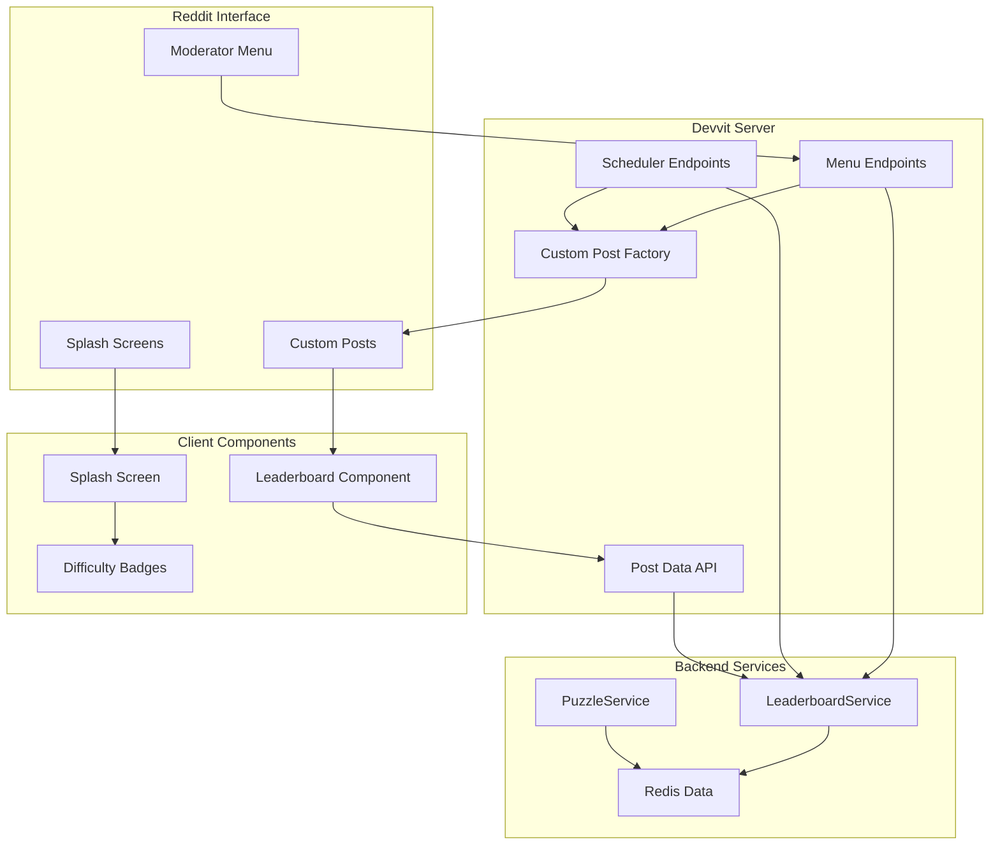

# Design Document

## Overview

This design enhances the existing ReflectIQ puzzle game by integrating the leaderboard system with Devvit's custom post functionality. The system will leverage the existing Leaderboard.tsx component and backend LeaderboardService to create interactive Reddit posts that display real-time leaderboard data. The design also includes adding difficulty level indicators to puzzle splash screens and ensuring both manual and automated leaderboard posts use the same high-quality UI components.

## Architecture

### High-Level Architecture



### Component Integration Flow

1. **Manual Leaderboard Creation**: Moderator clicks menu → Server fetches data → Creates custom post with postData → Client renders Leaderboard component
2. **Automated Leaderboard Creation**: Scheduler runs → Server fetches data → Creates custom post with postData → Client renders Leaderboard component
3. **Difficulty Display**: Puzzle post loads → Client reads postData → Renders splash screen with difficulty badge

## Components and Interfaces

### 1. Custom Post Type Registration

**File**: `src/server/index.ts` (enhancement)

```typescript
// Add custom post type registration for leaderboard posts
interface LeaderboardPostData {
  type: 'leaderboard';
  leaderboardType: 'daily' | 'weekly';
  date: string;
  entries: LeaderboardEntry[];
  stats: LeaderboardStats;
}

interface PuzzlePostData {
  puzzleDate: string;
  gameType: 'daily' | 'special' | 'challenge';
  difficulty: 'easy' | 'medium' | 'hard';
  status: 'active';
  splashVariant: number;
}
```

### 2. Enhanced Post Creation Service

**File**: `src/server/core/post.ts` (enhancement)

```typescript
export const createLeaderboardPost = async (
  leaderboardData: LeaderboardPostData,
  type: 'daily' | 'weekly' = 'daily'
) => {
  // Enhanced splash screen with difficulty indicators
  const splashConfig = generateLeaderboardSplashConfig(leaderboardData, type);

  return await reddit.submitCustomPost({
    subredditName: context.subredditName,
    title: generateLeaderboardTitle(leaderboardData, type),
    splash: splashConfig,
    postData: leaderboardData,
  });
};

// Enhanced puzzle post creation with difficulty in splash
export const createPuzzlePost = async (
  puzzleData: PuzzlePostData,
  difficulty: 'easy' | 'medium' | 'hard'
) => {
  const splashConfig = generatePuzzleSplashConfig(puzzleData, difficulty);

  return await reddit.submitCustomPost({
    subredditName: context.subredditName,
    title: generatePuzzleTitle(puzzleData, difficulty),
    splash: splashConfig,
    postData: { ...puzzleData, difficulty },
  });
};
```

### 3. Client-Side Post Data Integration

**File**: `src/client/pages/Leaderboard.tsx` (enhancement)

```typescript
// Enhanced Leaderboard component to work with Devvit postData
export default function Leaderboard() {
  const [postData, setPostData] = useState<LeaderboardPostData | null>(null);
  const [leaderboardData, setLeaderboardData] = useState<LeaderboardEntry[]>([]);
  const [stats, setStats] = useState<LeaderboardStats>({...});
  const [loading, setLoading] = useState(true);
  const [error, setError] = useState<string | null>(null);

  useEffect(() => {
    const fetchData = async () => {
      try {
        // First try to get postData from Devvit context
        const contextResponse = await fetch('/api/post-context');
        const contextData = await contextResponse.json();

        if (contextData.postData && contextData.postData.type === 'leaderboard') {
          // Use postData from custom post
          setPostData(contextData.postData);
          setLeaderboardData(contextData.postData.entries);
          setStats(contextData.postData.stats);
        } else {
          // Fallback to API call for standalone usage
          const apiService = ApiService.getInstance();
          const today = new Date().toISOString().split('T')[0];
          const response = await apiService.getDailyLeaderboard(today, 10);

          if (response.success && response.data) {
            // Transform and set data as before
            // ... existing transformation logic
          }
        }
      } catch (err) {
        // Error handling with fallback to sample data
        // ... existing error handling
      } finally {
        setLoading(false);
      }
    };

    fetchData();
  }, []);

  // Rest of component remains the same
  // ... existing render logic
}
```

### 4. Difficulty Badge Component

**File**: `src/client/components/DifficultyBadge.tsx` (new)

```typescript
interface DifficultyBadgeProps {
  difficulty: 'easy' | 'medium' | 'hard';
  size?: 'sm' | 'md' | 'lg';
  showIcon?: boolean;
}

export const DifficultyBadge: React.FC<DifficultyBadgeProps> = ({
  difficulty,
  size = 'md',
  showIcon = true
}) => {
  const configs = {
    easy: {
      color: 'bg-green-500/20 text-green-400 border-green-500/30',
      icon: '🟢',
      label: 'Easy'
    },
    medium: {
      color: 'bg-yellow-500/20 text-yellow-400 border-yellow-500/30',
      icon: '🟡',
      label: 'Medium'
    },
    hard: {
      color: 'bg-red-500/20 text-red-400 border-red-500/30',
      icon: '🔴',
      label: 'Hard'
    }
  };

  const config = configs[difficulty];
  const sizeClasses = {
    sm: 'text-xs px-2 py-1',
    md: 'text-sm px-3 py-1',
    lg: 'text-base px-4 py-2'
  };

  return (
    <Badge variant="outline" className={`${config.color} ${sizeClasses[size]}`}>
      {showIcon && config.icon} {config.label}
    </Badge>
  );
};
```

### 5. Enhanced Splash Screen Component

**File**: `src/client/components/SplashScreen.tsx` (new)

```typescript
interface SplashScreenProps {
  postData?: PuzzlePostData | LeaderboardPostData;
}

export const SplashScreen: React.FC<SplashScreenProps> = ({ postData }) => {
  if (!postData) return null;

  if (postData.type === 'leaderboard') {
    return (
      <div className="splash-screen leaderboard">
        <h1>🏆 Daily Leaderboard</h1>
        <p>{new Date(postData.date).toLocaleDateString()}</p>
        <p>{postData.entries.length} players competing</p>
      </div>
    );
  }

  // Puzzle splash screen with difficulty badge
  return (
    <div className="splash-screen puzzle">
      <h1>🔴 Daily ReflectIQ Puzzle</h1>
      <p>{new Date(postData.puzzleDate).toLocaleDateString()}</p>
      <DifficultyBadge
        difficulty={postData.difficulty}
        size="lg"
        showIcon={true}
      />
      <p>Trace the laser path to find the exit!</p>
    </div>
  );
};
```

## Data Models

### LeaderboardPostData Interface

```typescript
interface LeaderboardPostData {
  type: 'leaderboard';
  leaderboardType: 'daily' | 'weekly';
  date: string;
  weekStart?: string; // For weekly leaderboards
  weekEnd?: string; // For weekly leaderboards
  entries: Array<{
    rank: number;
    username: string;
    time: string;
    difficulty: 'easy' | 'medium' | 'hard';
    hintsUsed: number;
    score: number;
  }>;
  stats: {
    totalPlayers: number;
    totalSubmissions: number;
    fastestTime: string;
    topScore: number;
    puzzleStats: {
      easy: number;
      medium: number;
      hard: number;
    };
  };
}
```

### Enhanced PuzzlePostData Interface

```typescript
interface PuzzlePostData {
  puzzleDate: string;
  gameType: 'daily' | 'special' | 'challenge';
  difficulty: 'easy' | 'medium' | 'hard';
  status: 'active';
  splashVariant: number;
}
```

## Error Handling

### 1. Data Availability Fallbacks

```typescript
// Leaderboard component error handling
const handleDataFetch = async () => {
  try {
    // Try postData first
    const postDataResult = await fetchPostData();
    if (postDataResult.success) return postDataResult.data;

    // Fallback to API
    const apiResult = await fetchFromAPI();
    if (apiResult.success) return apiResult.data;

    // Final fallback to sample data
    return getSampleData();
  } catch (error) {
    console.error('Data fetch failed:', error);
    setError('Failed to load leaderboard data');
    return getSampleData();
  }
};
```

### 2. Menu Action Error Handling

```typescript
// Enhanced menu action with comprehensive error handling
router.post('/internal/menu/leaderboard', async (_req, res) => {
  try {
    const leaderboardData = await fetchLeaderboardData();

    if (!leaderboardData.entries.length) {
      // Handle empty leaderboard case
      return createEmptyLeaderboardPost(res);
    }

    const post = await createLeaderboardPost(leaderboardData);

    res.json({
      showToast: {
        text: `Leaderboard posted! ${leaderboardData.entries.length} players featured.`,
        appearance: 'success',
      },
      navigateTo: post.url,
    });
  } catch (error) {
    console.error('Leaderboard menu error:', error);
    res.json({
      showToast: {
        text: 'Failed to create leaderboard post. Please try again.',
        appearance: 'neutral',
      },
    });
  }
});
```

## Testing Strategy

### 1. Component Testing

- **Leaderboard Component**: Test with postData, API data, and sample data fallbacks
- **DifficultyBadge Component**: Test all difficulty levels and sizes
- **SplashScreen Component**: Test with both puzzle and leaderboard post data

### 2. Integration Testing

- **Menu Actions**: Test daily and weekly leaderboard creation
- **Post Data Flow**: Test data passing from server to client components
- **Error Scenarios**: Test network failures, empty data, and malformed data

### 3. End-to-End Testing

- **Manual Leaderboard Creation**: Full flow from menu click to post display
- **Automated Leaderboard Creation**: Scheduler execution and post creation
- **Cross-Device Compatibility**: Mobile and desktop rendering

## Performance Considerations

### 1. Data Caching

```typescript
// Cache leaderboard data to reduce Redis calls
const LEADERBOARD_CACHE_TTL = 300; // 5 minutes
const cachedLeaderboardData = new Map<
  string,
  {
    data: LeaderboardPostData;
    timestamp: number;
  }
>();

const getCachedLeaderboardData = (key: string) => {
  const cached = cachedLeaderboardData.get(key);
  if (cached && Date.now() - cached.timestamp < LEADERBOARD_CACHE_TTL * 1000) {
    return cached.data;
  }
  return null;
};
```

### 2. Component Optimization

```typescript
// Memoize expensive calculations in Leaderboard component
const memoizedStats = useMemo(() => {
  return calculateLeaderboardStats(leaderboardData);
}, [leaderboardData]);

const memoizedRankings = useMemo(() => {
  return processRankingData(leaderboardData);
}, [leaderboardData]);
```

### 3. Bundle Size Optimization

- Lazy load Leaderboard component when not immediately needed
- Use dynamic imports for large dependencies
- Optimize image assets used in splash screens

### 6. First-Attempt-Only Scoring System

**File**: `src/server/index.ts` (enhancement to `/api/puzzle/submit` endpoint)

```typescript
// Enhanced submission endpoint with first-attempt-only logic
router.post('/api/puzzle/submit', async (req, res) => {
  try {
    const { sessionId, answer, timeTaken } = req.body;

    // Get session and validate
    const session = await sessionService.getSession(sessionId);
    if (!session) {
      throw new ValidationError('Invalid session');
    }

    // Check if user has already completed this puzzle correctly
    // Only first correct attempt should count for leaderboard
    const hasAlreadyCompleted = await submissionService.hasUserCompleted(
      session.puzzleId,
      session.userId
    );
    if (hasAlreadyCompleted) {
      // User has already completed this puzzle, don't update leaderboard
      const existingSubmission = await submissionService.getUserSubmission(
        session.puzzleId,
        session.userId
      );
      if (existingSubmission) {
        return res.json(
          createSuccessResponse({
            scoreResult: {
              correct: true,
              finalScore: 0, // No score for repeat attempts
              baseScore: 0,
              hintMultiplier: 1,
              timeMultiplier: 1,
              hintsUsed: existingSubmission.hintsUsed,
              timeTaken: existingSubmission.timeTaken,
              maxPossibleScore: 0,
            },
            submission: existingSubmission,
            leaderboardPosition: null,
            message: 'Puzzle already completed. Only first correct attempt counts for leaderboard.',
          })
        );
      }
    }

    // Continue with normal submission flow for first attempts
    // ... existing submission logic
  } catch (error) {
    // ... existing error handling
  }
});
```

### 7. Difficulty-Filtered Leaderboard System

**File**: `src/server/services/LeaderboardService.ts` (enhancement)

```typescript
export class LeaderboardService {
  // ... existing methods

  /**
   * Get daily leaderboard filtered by difficulty
   * Requirements: 7.2, 7.3, 7.4, 7.5
   */
  async getDailyLeaderboardByDifficulty(
    difficulty: Difficulty,
    date?: string,
    limit: number = 10,
    offset: number = 0
  ): Promise<LeaderboardEntry[]> {
    try {
      const targetDate = date || new Date().toISOString().split('T')[0];
      const allEntries = await this.repository.getLeaderboard(`daily:${targetDate}`, 100, 0);

      // Filter by difficulty and sort by score (descending)
      const filteredEntries = allEntries
        .filter((entry) => entry.difficulty === difficulty)
        .sort((a, b) => b.score - a.score)
        .slice(offset, offset + limit);

      return filteredEntries;
    } catch (error) {
      console.error('Failed to get daily leaderboard by difficulty:', error);
      return [];
    }
  }
}
```

**File**: `src/server/index.ts` (enhancement to leaderboard API)

```typescript
// Enhanced daily leaderboard endpoint with difficulty filtering
router.get('/api/leaderboard/daily', async (req, res) => {
  try {
    const { date, limit = '10', offset = '0', difficulty } = req.query;

    let leaderboard;
    if (difficulty && ['easy', 'medium', 'hard'].includes(difficulty as string)) {
      // Get difficulty-specific leaderboard
      leaderboard = await leaderboardService.getDailyLeaderboardByDifficulty(
        difficulty as Difficulty,
        date as string,
        parseInt(limit as string),
        parseInt(offset as string)
      );
    } else {
      // Get combined leaderboard
      leaderboard = await leaderboardService.getDailyLeaderboard(
        date as string,
        parseInt(limit as string),
        parseInt(offset as string)
      );
    }

    res.json(createSuccessResponse(leaderboard));
  } catch (error) {
    console.error('Get daily leaderboard error:', error);
    const apiError = error as ApiError;
    res.status(apiError.statusCode || 500).json(createErrorResponse(apiError));
  }
});
```

### 8. Enhanced Leaderboard Component with Difficulty Filtering

**File**: `src/client/components/Leaderboard.tsx` (enhancement)

```typescript
import { Filter } from 'lucide-react';
import { Difficulty } from '../types/api';

export default function Leaderboard() {
  const [leaderboard, setLeaderboard] = useState<LeaderboardEntry[]>([]);
  const [loading, setLoading] = useState(true);
  const [error, setError] = useState<string | null>(null);
  const [selectedDifficulty, setSelectedDifficulty] = useState<Difficulty | 'all'>('easy'); // Default to easy

  const fetchLeaderboard = async () => {
    try {
      setLoading(true);
      setError(null);

      // Fetch leaderboard with difficulty filter
      const response = selectedDifficulty === 'all'
        ? await apiService.getDailyLeaderboard()
        : await apiService.getDailyLeaderboard(undefined, 10, selectedDifficulty);

      if (response.success && response.data) {
        setLeaderboard(response.data);
      } else {
        throw new Error('Failed to fetch leaderboard');
      }
    } catch (err) {
      console.error('Error fetching leaderboard:', err);
      setError('Failed to load leaderboard. Please try again.');
      toast.error('Failed to load leaderboard');
    } finally {
      setLoading(false);
    }
  };

  useEffect(() => {
    fetchLeaderboard();
  }, [selectedDifficulty]); // Refetch when difficulty changes

  return (
    <div className="min-h-screen bg-gradient-to-br from-slate-900 via-purple-900 to-slate-900">
      {/* Header */}
      <div className="text-center mb-8">
        <div className="flex items-center justify-center gap-3 mb-4">
          <Trophy className="h-8 w-8 text-yellow-500" />
          <h1 className="text-4xl font-orbitron font-bold bg-gradient-to-r from-yellow-400 via-yellow-500 to-orange-500 bg-clip-text text-transparent">
            Daily Leaderboard
          </h1>
          <Trophy className="h-8 w-8 text-yellow-500" />
        </div>
        <p className="text-foreground/70 text-lg">
          {selectedDifficulty === 'all'
            ? "Top players who've mastered today's laser puzzles"
            : `Top ${selectedDifficulty} difficulty players from today's challenges`
          }
        </p>
      </div>

      {/* Difficulty Filter */}
      <div className="flex items-center justify-center gap-2 mb-6">
        <Filter className="h-4 w-4 text-foreground/60" />
        <span className="text-sm text-foreground/60 mr-3">Filter by difficulty:</span>
        <div className="flex gap-2">
          {(['easy', 'medium', 'hard', 'all'] as const).map((difficulty) => (
            <button
              key={difficulty}
              onClick={() => setSelectedDifficulty(difficulty)}
              className={`px-4 py-2 rounded-lg text-sm font-medium transition-all duration-200 ${
                selectedDifficulty === difficulty
                  ? difficulty === 'easy'
                    ? 'bg-green-500/20 text-green-400 border border-green-500/30'
                    : difficulty === 'medium'
                    ? 'bg-yellow-500/20 text-yellow-400 border border-yellow-500/30'
                    : difficulty === 'hard'
                    ? 'bg-red-500/20 text-red-400 border border-red-500/30'
                    : 'bg-primary/20 text-primary border border-primary/30'
                  : 'bg-card/50 text-foreground/70 border border-border/50 hover:bg-card/80 hover:text-foreground/90'
              }`}
            >
              {difficulty === 'easy' && '🟢'}
              {difficulty === 'medium' && '🟡'}
              {difficulty === 'hard' && '🔴'}
              {difficulty === 'all' && '🎯'}
              <span className="ml-1">
                {difficulty.charAt(0).toUpperCase() + difficulty.slice(1)}
              </span>
            </button>
          ))}
        </div>
      </div>

      {/* Dynamic Statistics Cards */}
      <div className="grid grid-cols-1 md:grid-cols-4 gap-4 mb-8">
        <div className="bg-card/30 backdrop-blur-sm rounded-xl p-4 border border-border/30">
          <div className="flex items-center gap-3">
            <Clock className="h-5 w-5 text-blue-400" />
            <div>
              <p className="text-sm text-foreground/60">Fastest Time</p>
              <p className="text-xl font-orbitron font-bold text-blue-400">
                {leaderboard.length > 0
                  ? `${Math.floor(Math.min(...leaderboard.map(e => e.timeTaken)) / 60)}:${(Math.min(...leaderboard.map(e => e.timeTaken)) % 60).toString().padStart(2, '0')}`
                  : '00:00'
                }
              </p>
            </div>
          </div>
        </div>

        <div className="bg-card/30 backdrop-blur-sm rounded-xl p-4 border border-border/30">
          <div className="flex items-center gap-3">
            <TrendingUp className="h-5 w-5 text-green-400" />
            <div>
              <p className="text-sm text-foreground/60">Top Score</p>
              <p className="text-xl font-orbitron font-bold text-green-400">
                {leaderboard.length > 0
                  ? Math.max(...leaderboard.map(e => e.score)).toLocaleString()
                  : '0'
                }
              </p>
            </div>
          </div>
        </div>

        <div className="bg-card/30 backdrop-blur-sm rounded-xl p-4 border border-border/30">
          <div className="flex items-center gap-3">
            <Users className="h-5 w-5 text-purple-400" />
            <div>
              <p className="text-sm text-foreground/60">
                {selectedDifficulty === 'all' ? 'Total Players' : `${selectedDifficulty.charAt(0).toUpperCase() + selectedDifficulty.slice(1)} Players`}
              </p>
              <p className="text-xl font-orbitron font-bold text-purple-400">
                {leaderboard.length.toLocaleString()}
              </p>
            </div>
          </div>
        </div>

        <div className="bg-card/30 backdrop-blur-sm rounded-xl p-4 border border-border/30">
          <div className="flex items-center gap-3">
            <Star className="h-5 w-5 text-yellow-400" />
            <div>
              <p className="text-sm text-foreground/60">Avg. Completion</p>
              <p className="text-xl font-orbitron font-bold text-yellow-400">
                {leaderboard.length > 0
                  ? (() => {
                      const avgTime = leaderboard.reduce((sum, e) => sum + e.timeTaken, 0) / leaderboard.length;
                      return `${Math.floor(avgTime / 60)}:${(Math.floor(avgTime) % 60).toString().padStart(2, '0')}`;
                    })()
                  : '00:00'
                }
              </p>
            </div>
          </div>
        </div>
      </div>

      {/* Rest of existing leaderboard rendering logic */}
      {/* ... existing leaderboard table/cards */}
    </div>
  );
}
```

### 9. Enhanced API Service with Difficulty Support

**File**: `src/client/services/api.ts` (enhancement)

```typescript
export class ApiService {
  // ... existing methods

  /**
   * Get daily leaderboard with optional difficulty filtering
   */
  async getDailyLeaderboard(date?: string, limit: number = 10, difficulty?: Difficulty) {
    try {
      const params = new URLSearchParams();
      if (date) params.append('date', date);
      if (difficulty) params.append('difficulty', difficulty);
      params.append('limit', limit.toString());

      const response = await fetch(`/api/leaderboard/daily?${params}`, {
        method: 'GET',
        headers: {
          'Content-Type': 'application/json',
        },
      });

      if (!response.ok) {
        throw new Error(`HTTP error! status: ${response.status}`);
      }

      return await response.json();
    } catch (error) {
      console.error('Failed to get daily leaderboard:', error);
      throw error;
    }
  }
}
```

## Security Considerations

### 1. Data Validation

```typescript
// Validate leaderboard data before creating posts
const validateLeaderboardData = (data: any): data is LeaderboardPostData => {
  return (
    data &&
    typeof data.type === 'string' &&
    data.type === 'leaderboard' &&
    Array.isArray(data.entries) &&
    data.entries.every(
      (entry) =>
        typeof entry.username === 'string' &&
        typeof entry.score === 'number' &&
        ['easy', 'medium', 'hard'].includes(entry.difficulty)
    )
  );
};

// Validate submission attempts to prevent manipulation
const validateSubmissionAttempt = async (userId: string, puzzleId: string): Promise<boolean> => {
  const existingSubmission = await submissionService.getUserSubmission(puzzleId, userId);
  return !existingSubmission || !existingSubmission.isCorrect;
};
```

### 2. User Data Protection

- Only display Reddit usernames (no additional PII)
- Sanitize user input in leaderboard entries
- Implement rate limiting on menu actions
- Prevent score manipulation through repeat submissions

### 3. Access Control

- Ensure menu actions are restricted to moderators
- Validate subreddit context before creating posts
- Implement proper error messages without exposing internal details
- Validate difficulty filter parameters to prevent injection attacks
