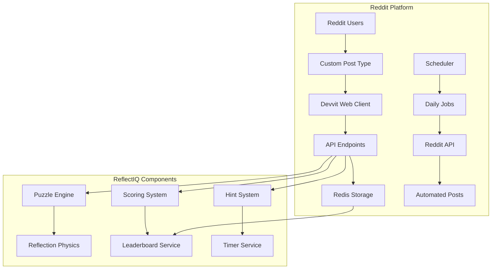

# Design Document

## Overview

ReflectIQ is designed as a Devvit Web application that leverages Reddit's native platform capabilities for hosting, data persistence, and user interaction. The architecture follows Devvit's client/server separation model with the frontend built using React/TypeScript and the backend using Node.js with Express-style routing. The system integrates deeply with Reddit's ecosystem through custom post types, automated scheduling, and Redis-based data persistence.

## Architecture

### High-Level Architecture



### Devvit Web Architecture

The application follows Devvit Web's client/server architecture:

- **Client Side (@devvit/web/client)**: React-based UI components for puzzle rendering, timer, hints, and user interactions
- **Server Side (@devvit/web/server)**: Express-style API endpoints for puzzle logic, scoring, and data management
- **Custom Post Type**: Reddit native post format that embeds the ReflectIQ game interface
- **Scheduler Integration**: Automated daily puzzle generation and leaderboard posting

### Data Flow

1. **Daily Cycle**: Scheduler triggers puzzle generation at midnight
2. **User Interaction**: Players access puzzles through custom Reddit posts
3. **Game Session**: Client communicates with server endpoints for puzzle data, hints, and submissions
4. **Scoring**: Server calculates scores and updates Redis-based leaderboards
5. **Automation**: Scheduler posts results and generates new puzzles

## Components and Interfaces

### 1. Custom Post Type Component

```typescript
// Custom post type for ReflectIQ game
interface ReflectIQPost {
  name: 'reflectiq-puzzle';
  height: 'tall';
  render: CustomPostComponent;
}
```

**Responsibilities:**

- Render the complete game interface within Reddit's viewport
- Handle responsive design for mobile and desktop
- Integrate with Reddit's comment system for answer submission
- Maintain single-viewport constraint (no scrolling)

### 2. Puzzle Engine Service

```typescript
interface PuzzleEngine {
  generateDailyPuzzles(): Promise<DailyPuzzleSet>;
  createPuzzle(difficulty: Difficulty): Promise<Puzzle>;
  validateSolution(puzzle: Puzzle): boolean;
  calculatePath(puzzle: Puzzle): LaserPath;
}

interface Puzzle {
  id: string;
  difficulty: 'Easy' | 'Medium' | 'Hard';
  gridSize: 6 | 8 | 10;
  materials: Material[];
  entry: [number, number];
  solution: [number, number];
  hints: HintPath[];
}
```

**Responsibilities:**

- Generate three daily puzzles with appropriate complexity
- Ensure viewport-optimized grid sizes (6x6, 8x8, 10x10)
- Maintain material density requirements (70%, 80%, 85%)
- Precompute hint paths and solutions

### 3. Reflection Physics Engine

```typescript
interface ReflectionEngine {
  traceLaserPath(puzzle: Puzzle): LaserPath;
  processReflection(material: Material, angle: number): ReflectionResult;
  calculateExit(path: LaserPath): [number, number];
}

interface Material {
  type: 'mirror' | 'water' | 'glass' | 'metal' | 'absorber';
  position: [number, number];
  angle?: number; // For mirrors
  properties: MaterialProperties;
}
```

**Responsibilities:**

- Simulate realistic laser physics through different materials
- Handle complex reflection scenarios with multiple materials
- Support probabilistic behaviors (water diffusion, glass pass-through)
- Ensure deterministic solutions for puzzle validation

### 4. API Endpoints Structure

```typescript
// Server endpoints following Devvit Web patterns
interface APIEndpoints {
  'GET /api/puzzle/current': (difficulty: Difficulty) => Promise<Puzzle>;
  'POST /api/puzzle/start': (puzzleId: string) => Promise<SessionData>;
  'POST /api/puzzle/hint': (sessionId: string, hintNumber: number) => Promise<HintData>;
  'POST /api/puzzle/submit': (submission: Submission) => Promise<ScoreResult>;
  'GET /api/leaderboard/daily': (date: string) => Promise<Leaderboard>;
}
```

### 5. Redis Data Schema

```typescript
// Redis key patterns for data organization
interface RedisSchema {
  // Daily puzzles
  'reflectiq:puzzles:{date}': DailyPuzzleSet;

  // User sessions
  'reflectiq:sessions:{sessionId}': SessionData;

  // Leaderboards (sorted sets)
  'reflectiq:leaderboard:{puzzleId}': SortedSet<ScoreEntry>;
  'reflectiq:leaderboard:daily:{date}': SortedSet<ScoreEntry>;

  // Submissions
  'reflectiq:submissions:{puzzleId}': Hash<Submission>;
}
```

## Data Models

### Core Game Models

```typescript
interface DailyPuzzleSet {
  date: string;
  puzzles: {
    easy: Puzzle;
    medium: Puzzle;
    hard: Puzzle;
  };
  status: 'active' | 'completed' | 'archived';
}

interface SessionData {
  sessionId: string;
  userId: string;
  puzzleId: string;
  startTime: Date;
  hintsUsed: number;
  status: 'active' | 'submitted';
}

interface Submission {
  userId: string;
  puzzleId: string;
  answer: [number, number];
  timeTaken: number;
  hintsUsed: number;
  score: number;
  correct: boolean;
  timestamp: Date;
}

interface LeaderboardEntry {
  rank: number;
  username: string;
  difficulty: string;
  time: number;
  hints: number;
  score: number;
}
```

### Material System Models

```typescript
interface MaterialProperties {
  reflectivity: number; // 0-1
  transparency: number; // 0-1
  diffusion: number; // 0-1 (for water)
  absorption: boolean; // for absorbers
}

interface LaserPath {
  segments: PathSegment[];
  exit: [number, number] | null;
  terminated: boolean;
}

interface PathSegment {
  start: [number, number];
  end: [number, number];
  direction: number; // angle in degrees
  material?: Material;
}
```

## Error Handling

### Client-Side Error Handling

```typescript
interface ErrorBoundary {
  // Handle puzzle loading failures
  onPuzzleLoadError: (error: Error) => void;

  // Handle API communication errors
  onAPIError: (endpoint: string, error: Error) => void;

  // Handle viewport/rendering issues
  onRenderError: (component: string, error: Error) => void;
}
```

### Server-Side Error Handling

```typescript
interface ErrorHandling {
  // Redis connection failures
  handleRedisError: (operation: string, error: Error) => Response;

  // Puzzle generation failures
  handlePuzzleError: (difficulty: Difficulty, error: Error) => Response;

  // Scoring calculation errors
  handleScoringError: (submission: Submission, error: Error) => Response;
}
```

### Error Recovery Strategies

1. **Puzzle Generation Failures**: Fallback to pre-generated puzzle templates
2. **Redis Connectivity Issues**: Implement local caching with eventual consistency
3. **Scoring Errors**: Queue submissions for retry with manual review
4. **Scheduler Failures**: Implement health checks and automatic restart mechanisms

## Testing Strategy

### Unit Testing

```typescript
// Puzzle Engine Tests
describe('PuzzleEngine', () => {
  test('generates valid puzzles for each difficulty');
  test('ensures material density requirements');
  test('validates solution uniqueness');
  test('maintains viewport constraints');
});

// Reflection Physics Tests
describe('ReflectionEngine', () => {
  test('calculates correct mirror reflections');
  test('handles water diffusion scenarios');
  test('processes glass pass-through behavior');
  test('terminates at absorber materials');
});
```

### Integration Testing

```typescript
// API Endpoint Tests
describe('API Integration', () => {
  test('puzzle retrieval workflow');
  test('hint system functionality');
  test('submission and scoring process');
  test('leaderboard generation');
});

// Redis Integration Tests
describe('Redis Integration', () => {
  test('data persistence and retrieval');
  test('leaderboard sorting accuracy');
  test('session management');
  test('automatic expiration handling');
});
```

### Devvit Platform Testing

```typescript
// Custom Post Type Tests
describe('Devvit Integration', () => {
  test('custom post rendering');
  test('viewport constraint compliance');
  test('Reddit comment integration');
  test('mobile/desktop responsiveness');
});

// Scheduler Tests
describe('Scheduler Integration', () => {
  test('daily puzzle generation');
  test('automated posting workflow');
  test('leaderboard publication');
  test('error recovery mechanisms');
});
```

### Performance Testing

1. **Load Testing**: Simulate concurrent users during peak puzzle release times
2. **Redis Performance**: Test leaderboard operations under high submission volumes
3. **Viewport Optimization**: Validate rendering performance across device types
4. **Memory Usage**: Monitor puzzle generation and caching efficiency

## Security Considerations

### Data Protection

1. **User Privacy**: Store minimal user data, use Reddit usernames only
2. **Answer Security**: Implement submission validation to prevent cheating
3. **Rate Limiting**: Protect API endpoints from abuse
4. **Data Expiration**: Automatic cleanup of old puzzle and session data

### Devvit Compliance

1. **Content Safety**: Ensure all generated puzzles comply with Reddit content policies
2. **User Deletion**: Implement automatic data removal for deleted Reddit accounts
3. **Namespace Isolation**: Maintain proper data separation between subreddit installations
4. **Resource Limits**: Stay within Redis storage and API rate limits

## Deployment and Scaling

### Devvit Deployment Model

```json
// devvit.json configuration
{
  "name": "reflectiq",
  "version": "1.0.0",
  "description": "Visual logic puzzle game with laser reflections",
  "customPostTypes": [
    {
      "name": "reflectiq-puzzle",
      "height": "tall"
    }
  ],
  "scheduler": {
    "tasks": {
      "daily-puzzle-generation": {
        "endpoint": "/internal/scheduler/generate-puzzles",
        "cron": "0 0 * * *"
      },
      "daily-leaderboard-post": {
        "endpoint": "/internal/scheduler/post-leaderboard",
        "cron": "0 1 * * *"
      }
    }
  },
  "redis": true
}
```

### Scaling Considerations

1. **Redis Limits**: 500MB storage, 1000 commands/second per installation
2. **Subreddit Isolation**: Each installation maintains separate data namespace
3. **Concurrent Users**: Design for peak loads during daily puzzle releases
4. **Global Distribution**: Leverage Reddit's CDN for static assets

### Monitoring and Maintenance

1. **Health Checks**: Monitor puzzle generation success rates
2. **Performance Metrics**: Track API response times and Redis usage
3. **Error Logging**: Comprehensive logging for debugging and optimization
4. **User Analytics**: Track engagement metrics while respecting privacy
