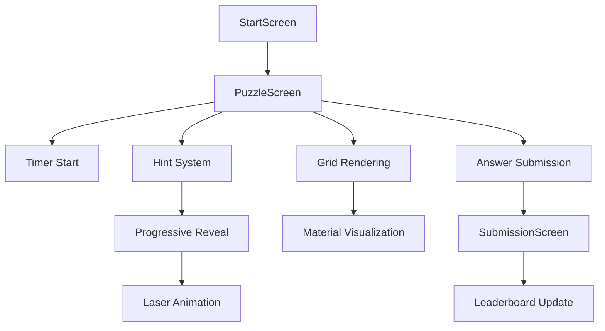

# ReflectIQ - Strategic Laser Puzzle Game

## 🎯 Project Overview

ReflectIQ is an innovative laser reflection puzzle game built for Reddit using the Devvit platform. Players must trace invisible laser beams through hidden grids filled with mirrors, glass, water, and other materials using strategic hint management and physics-based deduction.

### 🚀 Key Innovation

Unlike traditional puzzle games, ReflectIQ presents players with a **completely hidden grid** at the start. Players can only see the laser entry point and must strategically use exactly 4 hints to reveal quarter-sections, balancing information gathering with solving speed.

## 🏗️ Architecture Overview

### Technology Stack

- **Platform**: Reddit Devvit (Web Components)
- **Frontend**: React 18 + TypeScript + Vite
- **Backend**: Express 5 + Node.js
- **Styling**: Tailwind CSS 4 + Custom Design System
- **State Management**: React Hooks + TanStack Query
- **UI Components**: Radix UI + Custom Components
- **Icons**: Lucide React
- **Notifications**: Sonner Toast System
- **Testing**: Vitest
- **Build Tools**: Vite 5 + TypeScript 5

### Project Structure

```
reflectiq/
├── 📁 src/
│   ├── 📁 client/                    # React Frontend Application
│   │   ├── 📁 components/            # React Components
│   │   │   ├── 📁 puzzle/           # Game-specific components
│   │   │   │   ├── PuzzleGrid.tsx   # Main grid renderer with animation
│   │   │   │   ├── PuzzleScreen.tsx # Game interface controller
│   │   │   │   ├── GridCell.tsx     # Individual cell component
│   │   │   │   ├── HintButton.tsx   # Hint system interface
│   │   │   │   ├── Timer.tsx        # Real-time game timer
│   │   │   │   └── AnswerInput.tsx  # Answer submission form
│   │   │   ├── 📁 ui/               # Reusable UI components (Radix)
│   │   │   ├── StartScreen.tsx      # Landing page with animations
│   │   │   ├── LoadingScreen.tsx    # Loading states
│   │   │   ├── ErrorScreen.tsx      # Error handling
│   │   │   ├── SubmissionScreen.tsx # Post-game results
│   │   │   └── ErrorBoundary.tsx    # Error boundary wrapper
│   │   ├── 📁 hooks/                # Custom React Hooks
│   │   │   └── use-game-state.ts    # Main game state management
│   │   ├── 📁 services/             # API Services
│   │   │   └── enhanced-api.ts      # API client with error handling
│   │   ├── 📁 utils/                # Client utilities
│   │   │   └── navigation.ts        # Reddit navigation helpers
│   │   ├── 📁 types/                # Client-side types
│   │   │   └── api.ts               # API type definitions
│   │   ├── 📁 pages/                # Route components
│   │   │   └── Index.tsx            # Main game page
│   │   ├── App.tsx                  # Root application component
│   │   ├── main.tsx                 # React entry point
│   │   ├── index.css                # Global styles + animations
│   │   └── vite.config.ts           # Vite configuration
│   │
│   ├── 📁 server/                   # Express Backend
│   │   ├── 📁 routes/               # API Route Handlers
│   │   │   ├── puzzleRoutes.ts      # Puzzle CRUD operations
│   │   │   └── leaderboardRoutes.ts # Leaderboard management
│   │   ├── 📁 services/             # Business Logic Services
│   │   │   ├── PuzzleService.ts     # Puzzle generation & management
│   │   │   ├── LeaderboardService.ts # Scoring & rankings
│   │   │   └── CommentProcessor.ts  # Reddit comment parsing
│   │   ├── 📁 data/                 # Data Access Layer
│   │   │   ├── PuzzleRepository.ts  # Puzzle data operations
│   │   │   └── SessionRepository.ts # Session management
│   │   ├── 📁 core/                 # Core Devvit Integration
│   │   │   ├── post.ts              # Post creation & management
│   │   │   ├── triggers.ts          # Reddit event handlers
│   │   │   └── scheduler.ts         # Automated tasks
│   │   ├── 📁 utils/                # Server utilities
│   │   │   ├── redisClient.ts       # Redis connection
│   │   │   └── errorHandler.ts      # Error handling middleware
│   │   ├── 📁 tests/                # Test Suite
│   │   │   └── integration/         # Integration tests
│   │   ├── index.ts                 # Server entry point
│   │   └── vite.config.ts           # Server build configuration
│   │
│   └── 📁 shared/                   # Shared Code
│       ├── 📁 types/                # TypeScript Definitions
│       │   ├── puzzle.ts            # Core puzzle types
│       │   ├── game.ts              # Game state types
│       │   └── api.ts               # API contract types
│       ├── 📁 physics/              # Physics Engine
│       │   ├── constants.ts         # Game constants
│       │   └── laserEngine.ts       # Laser simulation
│       └── 📁 utils/                # Shared utilities
│           └── validation.ts        # Input validation
│
├── 📁 assets/                       # Static Assets
│   └── RQ-icon.png                  # App icon
├── 📁 dist/                         # Build Output
│   ├── 📁 client/                   # Client build
│   └── 📁 server/                   # Server build
├── 📁 .kiro/                        # Kiro IDE Configuration
│   └── 📁 specs/                    # Development specs
├── devvit.json                      # Devvit platform configuration
├── package.json                     # Dependencies & scripts
├── tsconfig.json                    # TypeScript configuration
└── README.md                        # This file
```

## 🎮 Game Architecture

### Core Game Flow



### Component Hierarchy

```
App
├── ErrorBoundary
│   └── Router
│       ├── Index (Main Game Page)
│       │   ├── StartScreen
│       │   │   ├── Particle Animation (20 floating particles)
│       │   │   ├── Gradient Title Effects
│       │   │   └── How to Play Guide
│       │   ├── PuzzleScreen (Game Controller)
│       │   │   ├── Timer (MM:SS format)
│       │   │   ├── HintButton (4-hint system)
│       │   │   ├── PuzzleGrid (Main game area)
│       │   │   │   ├── GridCell[] (Individual cells)
│       │   │   │   └── SVG Laser Overlay
│       │   │   └── AnswerInput (Coordinate selection)
│       │   ├── SubmissionScreen (Results)
│       │   ├── LoadingScreen
│       │   └── ErrorScreen
│       └── Leaderboard (Rankings)
└── Toaster (Global notifications)
```

### State Management Architecture

#### Game State Hook (`use-game-state.ts`)

```typescript
interface GameStateData {
  // App initialization
  appData: InitResponse | null;
  gameState: 'loading' | 'menu' | 'playing' | 'completed' | 'error';

  // Puzzle data
  currentPuzzle: Puzzle | null;
  session: SessionData | null;
  selectedDifficulty: Difficulty | null;

  // Game progress
  hintsUsed: number;
  hintPaths: HintPath[];
  isTimerRunning: boolean;
  finalTime: number | null;
  selectedAnswer: GridPosition | null;
  isRequestingHint: boolean;

  // Results & scoring
  scoreResult: ScoreResult | null;
  leaderboardPosition: number | null;

  // Error handling
  error: string | null;
  errorType: ApiError['type'] | null;
}
```

## 🔧 Technical Implementation

### Frontend Architecture

#### React Component System

- **Functional Components**: All components use React hooks
- **TypeScript**: Strict type checking throughout
- **Custom Hooks**: Centralized state management
- **Error Boundaries**: Graceful error handling
- **Responsive Design**: Mobile-first approach

#### Animation System

```css
/* Progressive hint reveal animation */
@keyframes fadeInGlow {
  0% {
    opacity: 0;
    stroke-width: 0.05;
    filter: drop-shadow(0 0 2px rgba(255, 45, 85, 0.3));
  }
  50% {
    opacity: 0.8;
    stroke-width: 0.2;
    filter: drop-shadow(0 0 12px rgba(255, 45, 85, 1));
  }
  100% {
    opacity: 1;
    stroke-width: 0.1;
    filter: drop-shadow(0 0 10px rgba(255, 45, 85, 0.8));
  }
}
```

#### Design System

```css
:root {
  /* Color Palette */
  --primary: 211 100% 50%; /* Electric Blue */
  --laser: 348 100% 59%; /* Laser Red */
  --background: 217 71% 8%; /* Dark Blue */

  /* Material Colors */
  --mirror: 0 0% 75%; /* Silver */
  --glass: 150 60% 50%; /* Green */
  --water: 200 80% 60%; /* Blue */
  --metal: 0 70% 50%; /* Red */
  --absorber: 0 0% 10%; /* Black */

  /* Effects */
  --glow-primary: 0 0 20px hsl(var(--primary) / 0.5);
  --glow-laser: 0 0 30px hsl(var(--laser) / 0.6);
}
```

### Backend Architecture

#### Express Server Structure

```typescript
// Main server setup
app.use('/api/puzzle', puzzleRoutes);
app.use('/api/leaderboard', leaderboardRoutes);
app.use('/internal', internalRoutes);

// Devvit integration
app.post('/internal/triggers/comment-submit', commentHandler);
app.post('/internal/scheduler/generate-puzzles', puzzleGenerator);
app.post('/internal/menu/post-create', postCreator);
```

#### Data Flow

```
Client Request → Express Router → Service Layer → Repository → Redis
                                      ↓
Client Response ← JSON Response ← Business Logic ← Data Access
```

#### Redis Data Schema

```typescript
interface RedisSchema {
  // Daily puzzles: reflectiq:puzzles:{date}
  puzzles: DailyPuzzleSet;

  // User sessions: reflectiq:sessions:{sessionId}
  sessions: SessionData;

  // Submissions: reflectiq:submissions:{puzzleId}
  submissions: Record<string, Submission>;

  // Leaderboards: reflectiq:leaderboard:{puzzleId}
  leaderboards: LeaderboardEntry[];
}
```

### Physics Engine

#### Material System

```typescript
interface Material {
  type: 'mirror' | 'water' | 'glass' | 'metal' | 'absorber';
  position: GridPosition;
  angle?: number; // For mirrors (0-360°)
  properties: MaterialProperties;
}

interface MaterialProperties {
  reflectivity: number; // 0-1
  transparency: number; // 0-1
  diffusion: number; // 0-1 (for water)
  absorption: boolean; // true for absorbers
}
```

#### Laser Physics

```typescript
interface LaserPath {
  segments: PathSegment[];
  exit: GridPosition | null;
  terminated: boolean;
}

interface PathSegment {
  start: GridPosition;
  end: GridPosition;
  direction: number; // angle in degrees
  material?: Material;
}
```

## 🎯 Game Mechanics

### Progressive Hint System

The game's signature feature is the 4-hint progressive revelation system:

1. **Complete Information Blackout**: Players start with a hidden grid
2. **Strategic Quadrant Reveals**: 4 hints reveal quarters sequentially
3. **Resource Management**: Limited hints force strategic decisions
4. **Animated Laser Visualization**: Full path shown after all hints used

#### Hint Implementation

```typescript
// Progressive animation logic in PuzzleGrid.tsx
useEffect(() => {
  if (hintsUsed > lastHintLevel && hintsUsed > 0) {
    const latestHintSegments = getSegmentsForHintLevel(hintsUsed);

    if (latestHintSegments.length > 0) {
      setAnimatingSegments(latestHintSegments);

      const timer = setTimeout(() => {
        setVisibleSegments(getAllSegmentsUpToLevel(hintsUsed));
        setAnimatingSegments([]);
        setLastHintLevel(hintsUsed);
      }, 800);

      return () => clearTimeout(timer);
    }
  }
}, [hintsUsed, lastHintLevel, hintPaths]);
```

### Difficulty Levels

| Difficulty | Grid Size | Materials | Base Score | Max Time |
| ---------- | --------- | --------- | ---------- | -------- |
| Easy       | 6x6       | 4         | 150        | 300s     |
| Medium     | 8x8       | 10        | 400        | 600s     |
| Hard       | 10x10     | 14+       | 800        | 900s     |

### Scoring Algorithm

```typescript
const finalScore = correct ? Math.round(baseScore * hintMultiplier * timeMultiplier) : 0;

// Where:
// hintMultiplier = [1.0, 0.8, 0.6, 0.4, 0.2][hintsUsed]
// timeMultiplier = Math.max(0, (maxTime - timeTaken) / maxTime)
```

## 🚀 Development Setup

### Prerequisites

- Node.js 18+
- npm or yarn
- Devvit CLI (`npm install -g devvit`)
- Reddit Developer Account

### Installation

1. **Clone Repository**

```bash
git clone https://github.com/yourusername/reflectiq.git
cd reflectiq
```

2. **Install Dependencies**

```bash
npm install
```

3. **Environment Setup**

```bash
cp .env.template .env
# Configure your environment variables
```

4. **Devvit Authentication**

```bash
npm run login
```

### Development Commands

#### Core Development

```bash
# Start full development environment
npm run dev

# Individual services
npm run dev:client    # Client development server
npm run dev:server    # Server development with watch
npm run dev:devvit    # Devvit playtest environment
npm run dev:vite      # Vite dev server (port 7474)
```

#### Build & Deploy

```bash
# Build for production
npm run build

# Type checking & linting
npm run check

# Deploy to Devvit
npm run deploy

# Full deployment pipeline
npm run launch
```

#### Testing

```bash
# Run tests
npm run test

# Watch mode
npm run test:watch
```

### Development Workflow

1. **Local Development**: Use `npm run dev` for hot reloading
2. **Testing**: Run `npm run test:watch` for continuous testing
3. **Type Safety**: Use `npm run check` before commits
4. **Deployment**: Use `npm run deploy` for Devvit uploads
5. **Production**: Use `npm run launch` for full deployment

## 🔌 Devvit Integration

### Configuration (`devvit.json`)

```json
{
  "name": "reflectiq",
  "permissions": {
    "redis": true,
    "reddit": {
      "enable": true,
      "asUser": ["SUBMIT_POST", "SUBMIT_COMMENT"]
    }
  },
  "scheduler": {
    "tasks": {
      "daily-puzzle-generation": {
        "endpoint": "/internal/scheduler/generate-puzzles",
        "cron": "0 0 * * *"
      }
    }
  },
  "triggers": {
    "onAppInstall": "/internal/on-app-install",
    "onCommentSubmit": "/internal/triggers/comment-submit"
  }
}
```

### Reddit Integration Features

#### Automated Daily Puzzles

- **Scheduler**: Generates 3 difficulty levels daily at midnight
- **Post Creation**: Creates puzzle posts with embedded game
- **Comment Monitoring**: Processes answer submissions automatically

#### Moderator Tools

- **Menu Actions**: Create puzzles, view leaderboards
- **Leaderboard Posts**: Automated daily/weekly rankings
- **Maintenance**: Weekly cleanup and optimization

#### User Experience

- **In-Post Gaming**: Play directly within Reddit posts
- **Comment Submission**: Submit answers via Reddit comments
- **Real-time Updates**: Live leaderboard updates

## 🎨 Visual Design System

### Color Palette

- **Primary**: Electric Blue (#007AFF) - UI elements, buttons
- **Laser**: Laser Red (#FF2D55) - Laser beams, accents
- **Background**: Dark Blue Gradient - Immersive atmosphere
- **Materials**: Distinct colors for each material type

### Typography

- **Headings**: Montserrat (modern, clean)
- **Body**: Poppins (readable, friendly)
- **Monospace**: Orbitron (futuristic, timer display)

### Animation Principles

- **Progressive Disclosure**: Smooth hint reveals
- **Physics-Based**: Realistic laser beam animations
- **Feedback**: Immediate visual responses
- **Performance**: 60fps animations with CSS transforms

## 📊 Performance & Optimization

### Frontend Optimization

- **Code Splitting**: Dynamic imports for routes
- **Bundle Analysis**: Vite bundle optimization
- **Image Optimization**: Compressed assets
- **Caching**: Service worker for offline support

### Backend Optimization

- **Redis Caching**: Fast data retrieval
- **Connection Pooling**: Efficient database connections
- **Rate Limiting**: API protection
- **Error Handling**: Graceful degradation

### Monitoring

- **Error Tracking**: Comprehensive error boundaries
- **Performance Metrics**: Real-time monitoring
- **User Analytics**: Gameplay statistics
- **Health Checks**: System status monitoring

## 🧪 Testing Strategy

### Unit Testing

- **Components**: React Testing Library
- **Hooks**: Custom hook testing
- **Services**: API service testing
- **Utilities**: Pure function testing

### Integration Testing

- **API Endpoints**: Full request/response testing
- **Database**: Redis integration testing
- **Game Flow**: End-to-end game scenarios

### E2E Testing

- **User Journeys**: Complete gameplay flows
- **Cross-Browser**: Multi-browser compatibility
- **Mobile**: Touch interaction testing

## 🚀 Deployment & CI/CD

### Build Pipeline

1. **Type Checking**: TypeScript compilation
2. **Linting**: ESLint validation
3. **Testing**: Unit and integration tests
4. **Building**: Vite production builds
5. **Deployment**: Devvit platform upload

### Environment Management

- **Development**: Local development with hot reload
- **Staging**: Devvit playtest environment
- **Production**: Live Reddit deployment

### Monitoring & Maintenance

- **Health Checks**: Automated system monitoring
- **Error Tracking**: Real-time error reporting
- **Performance**: Continuous performance monitoring
- **Updates**: Automated dependency updates

## 🤝 Contributing

### Development Guidelines

1. **TypeScript**: Strict type checking required
2. **Testing**: Write tests for new features
3. **Documentation**: Update docs for changes
4. **Code Style**: Follow ESLint/Prettier rules

### Pull Request Process

1. Fork the repository
2. Create feature branch
3. Write tests
4. Update documentation
5. Submit pull request

## 📄 License

This project is licensed under the BSD-3-Clause License - see the [LICENSE](LICENSE) file for details.

## 🙏 Acknowledgments

- **Reddit Devvit Team**: Platform and development tools
- **React Community**: Component patterns and best practices
- **Tailwind CSS**: Design system foundation
- **Open Source Contributors**: Various libraries and tools

---

**Ready to challenge your spatial reasoning and physics intuition?** ReflectIQ combines the satisfaction of solving complex puzzles with the engaging social experience of Reddit. Dive in and start tracing those laser beams! 🔴✨
